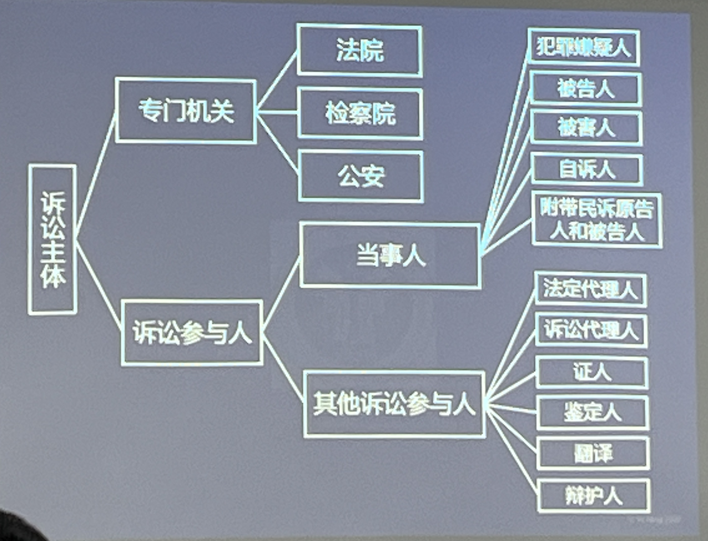

#### 诉讼主体
1. 承担控诉职能或辩护职能的;
2. 与案件事实和案件处理结果有直接利害关系的:
# 犯罪嫌疑人、被告人
被指控犯有某种罪行而被公安、司法机关追究刑事责任的人。
- 划分依据：诉讼阶段
- 犯罪嫌疑人←提起公诉→被告人
- 自诉案件:只有被告人、无犯罪嫌疑人
## 犯罪嫌疑人、被告人的诉讼地位
犯罪嫌疑人、被告人是刑事诉讼中的核心诉讼主体

 **犯罪嫌疑人、被告人一旦死亡，刑事诉讼活动即告终止(特别没收程序、缺席审判程序除外)**保障被告人的参与权

1. 犯罪嫌疑人、被告人是拥有一系列诉讼权利的诉讼主体，居于当事人的地位。享有积极防御的权利。(防御权)**权利维度**
2. 犯罪嫌疑人、被告人与案件结局有着直接利害关系，居于被追诉者的地位。负有承受侦查、强制措施、接受传唤，按时出庭受审的义务。**义务维度**
3. 犯罪嫌疑人、被告人本身还可以成为重要的证据来源。**证据维度**
### 犯罪嫌疑人、被告人具体的诉讼权利和义务
#### 犯罪嫌疑人、被告人的诉讼权利
1. 防御权
   1. 有权使用本民族语言文字进行诉讼。
   2. 辩护权
   3. 不被强迫自证其罪、特定条件下的拒证权
   4. 告知权
   5. 参加法庭调查权
   6. 参加法庭辩论权
   7. 最后陈述权
   8. 反诉权
   9. 无罪推定的权利
2. 救济权
   1. 申请回避权
   2. 提出控告权
   3. 解除法定羁押
   4. 上诉权(未生效裁判)
   5. 申诉权(已生效裁判)
#### 犯罪嫌疑人、被告人的义务
犯罪嫌疑人、被告人所应承担的法律义务主要有
1. 在符合法定条件的情况下承受逮捕、拘留、监视居住、拘传等强制措施。
2. 接受侦查人员的讯问、搜查、扣押等侦查行为
3. 对侦查人员的讯问，**应当如实回答**。
4. 承受检察机关的起诉，依法按时出席并接受法庭审判
5. 对于生效的裁定和判决，有义务执行或协助执行等
# 被害人
被害人:因人身、财产或其他权益遭受犯罪行为侵害而与案件处理结果具有直接利害关系的诉讼当事人。
##### 刑诉法和刑法的区别
- 刑法：自然人、法人
- 刑诉法：自然人(法人→诉讼代表人)
### 被害人的诉讼角色
- 被害人在诉讼中可能担当各种诉讼角色:
  - 自诉案件:自诉人
  - 附带民事诉讼:附带民事诉讼的原告人
- 被害人(刑事公诉)具有**独立当事人地位**是我国刑事诉讼法的一大特色
### 被害人的诉讼权利
#### 与其他当事人共有的诉讼权利
1. 控告权
2. 回避申请权
3. 参加庭审权
4. 申诉权
5. 使用本民族语言文字权
#### 被害人特有的诉讼权利
1. 立案请求权
2. 委托代理权(时间:移送审查起诉之日)
3. 申请复议权
4. 申诉权
5. 自诉权(公诉案件)
6. 申请抗诉权
# 自诉人
自诉人:自诉案件的原告人，以个人名义直接向法院提起诉讼，要求追究被告人刑事责任的诉讼主体。
#### 存在自诉人的刑事案件类型
1. 告诉才处理的犯罪案件
2. 轻微刑事案件
3. 公诉转自诉案件
#### 通常担任自诉人的主体
1. 被害人
2. 被害人的法定代理人、近亲属(被害人死亡或者丧失行为能力时)
### 自诉人的诉讼权利
1. 起诉权
2. 自行和解权
3. 撤诉权
4. 委托代理权(随时)
5. 申请调查取证权
6. 上诉权
7. 申诉权
### 自诉人的诉讼义务
1. 承担举证责任。自诉人对自己的主张和请求应当提供证据证明。如实提供案件真实情况的义务。如故意伪造证据陷害他人，必须承担法律责任。
2. 按时出庭、遵守法庭秩序的义务。执行人民法院生效的调解协议、判决或者裁定的义务。
# 附带民事诉讼原告人、被告人
### 附带民事诉讼原告人主要享有以下诉讼权利:
1. 提起附带民事诉讼，要求赔偿**物质损失**;
2. 申请回避;委托诉讼代理人;
3. 参加法庭调査和法庭辩论，并对附带民事诉讼部分提供证据、发表意见
4. 如不服一审判决或者裁定，可以提出上诉
5. 请求人民法院主持调解或者与附带民事诉讼、被告人自行和解
6. 申请人民法院采取査封、扣押或者冻结被告人的财产等财产保全措施
### 附带民事诉讼原告人主要诉讼义务
1. 对于附带民事诉讼请求提供证据
2. 如实陈述案情
3. 按时出庭、遵守法庭秩序。
### 附带民事诉讼被告人诉讼权利和义务
#### 诉讼权利
1. 申请回避;
2. 委托诉讼代理人;
3. 参加法庭调査和法庭辩论，并对附带民事诉讼部分提供证据、发表意见
4. 如不服一审判决或者裁定，可以提出上诉;
5. 请求人民法院主持调解或者与附带民事诉讼被告人自行和解:
6. 提出反诉。
#### 诉讼义务
1. 对自己的主张提供证据证明
2. 如实陈述案情
3. 按时出庭、遵守法庭秩序
4. 执行已经生效裁判中附带民诉部分
# 法定代理人
>法定代理人:被代理人的父母、养父母、监护人和负有保护责任的机关、团体的代表【刑诉法》第106条第3项】。
1. 法定代理人根据**法律规定**参加刑事诉讼活动，而不是基于委托关系。
2. 法定代理人在诉讼过程中具有**独立的法律地位**，不受被代理人意志的约束，在进人诉讼和行使代理权利时无须经过被代理人同意或者授权
3. 法定代理人的行为视为被代理人的行为，与之具有**相同的法律效果**。
# 诉讼代理人
诉讼代理人:受被代理人的委托或者法院的指定依法参加诉讼，以维护被代理人合法权益的人。
#### 被代理人通常是:
1. 公诉案件被害人及其法定代理人或近亲属
2. 自诉案件自诉人
3. 附带民诉当事人
4. 没收违法所得程序中犯罪嫌疑人、被告人的近亲属和其他
5. 利害关系人
6. 强制医疗程序中被申请人或被告人
## 法定代理人与诉讼代理人区别
|主体|产生|被代理人或委托人|代理人范围|诉讼权利|
|:---:|:---:|:---:|:---:|:---:|
|法定代理人|法律规定|限制行为能力人和无行为能力人|被代理人父母、养父母、监护人、负有保护责任的机关、团体的代表|权利基本等同于被告人人身性质的权利不能代理|
|诉讼代理人|委托|被害人及其法定代理人或近亲属、自诉人、附带民诉当事人、没收违法所得程序中犯罪嫌疑人、被告人的近亲属和其他利害关系人、强制医疗程序中被申请人或被告人|律师、人民团体或被代理人所在单位推荐的人被代理人监护人、亲友|委托人授权范围内|
# 证人
### 证人资格
1. 自然人
2. 了解案件情况
3. 生理上，精神上，年幼，并且不能正确表达，不能明辨是非的不能作为证人
#### 特点:不可替代性，优先性
#### 权利
1. 查阅证言笔录
2. 控告权
3. 经济补偿
4. 要求公安司法机关保证其本人及其近亲属的安全