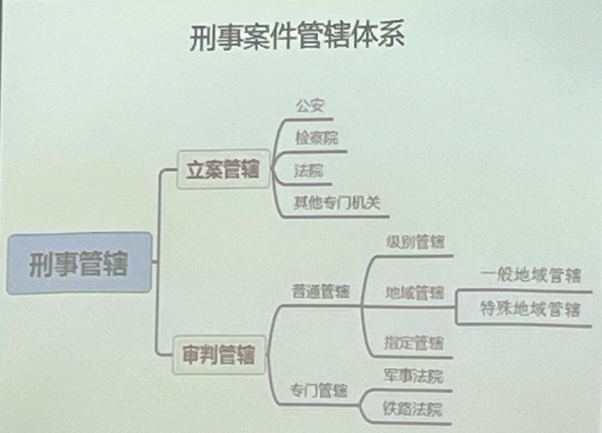

# 第四章 管辖
# 第一节 管辖制度
## 管辖概述
我国刑事诉讼中的管辖，是指公安机关、人民检察院和人民法院等依照法律规定立案受理刑事案件以及人民法院系统内审理第一审刑事案件的分工制度(立案管辖与审判管辖)
- 实质:公安、司法机关(专门机关)在受理刑事案件方面的权限划分。

# 第二节 管辖类型
## 一、立案管辖
- 指公检法三机关(及其他专门机关)之间在直接受理刑事案件的权限划分
- 诉讼理论上也称为职能管辖
- 确定原则:是根据司法机关在刑事诉讼中的职责分工，以及刑事案件的性质、案情的轻重、复杂程度等不同情况
- 一般规则
1. 多数案件公安管
2. 公职人员职务犯罪监委管
3. 司法人员特定犯罪检察管
4. 三类自诉案件法院管
### 法院直接受理的刑事案件
#### 告诉才处理的案件
1. 侮辱案(严重危害社会秩序和国家利益的除外)
2. 诽谤案(严重危害社会秩序和国家利益除外)通过信息网络实施诽谤罪，被害人提起自诉，但提供证据确有困难的人民法院可以要求**公安机关提供协助**(《刑九修正案》)
3. 暴力干涉婚姻自由案(致使被害人死亡的除外)
4. 虐待案(致使被害人重伤、死亡的除外;**被害人没有能力告诉，或者因受到强制、威吓无法告诉的，应按照公诉案件处理**，由人民检察院提起公诉)
5. 侵占私人财物案(**绝对的告诉才处理**)
#### 被害人有证据证明的轻微刑事案件
- 被害人向法院直接起诉的:法院应当受理
- 证据不足，或可能判处3年以上有期徒刑的;被害人向公安机关提出控告的:公安机关应受理
#### 公诉转自诉的案件
这类案件本质上属于**公诉**案件，应当由公安或检察机关立案侦查，被
害人对这类案件提出自诉，受以下四项条件的限制
1. 被害人**有证据证明**被告人的行为构成犯罪，并且应当追究刑事责任
2. 被告人的行为侵犯的是被害人的**人身**权利或**财产**权利
3. 应当追究被告人刑事责任
4. (前提条件)公安或检察机关已经作出**不予追究**刑事责任的决定(不立案、撤销案件、不起诉)
- 注：此类自诉案件**不得调解、不得反诉**
### 监察法与刑事诉讼法的衔接
#### 监察委管辖的案件范围
>《监察法》第十一条 监察委员会依照本法和有关法律规定履行监督调查、处置职责\
(一)对公职人员开展廉政教育，对其依法履职、秉公用权、洁从政从业以及道德操守情况进行监督检査:\
(二)对涉嫌贪污贿赂、滥用职权、玩忽职守、权力寻租、利益输送徇私舞弊以及浪费国家资财等职务违法和职务犯罪进行调查\
(三)对违法的公职人员依法作出政务处分决定:对履行职责不力、失职失贵的领导人员进行问责;对涉嫌职务犯罪的，将调查结果移送人民检察院依法审查、提起公诉，向监察对象所在单位提出监察建议\

《监察法》赋予了各级监察机关对公职人员违纪、违法、犯罪三类案件进行监察调查的广泛职权，以实现对所有公职人员的“监察全覆盖”
#### 监察委与过去检察院管辖案件范围对比
|对比问题|检察院|监察委|
|:---:|:---:|:---:|
|管辖案件类型|职务犯罪案件|违纪/违法/公职犯罪案件|
|管辖涉及对象|仅限国家工作人员|公职人员(六大类)|
|管辖刑案种类|贪污贿赂犯罪/国家工作人员的渎职犯罪/国家机关工作人员利用职权实施的侵犯公民人身权利、民主权利的犯罪案件|公职人员实施的职务犯罪|