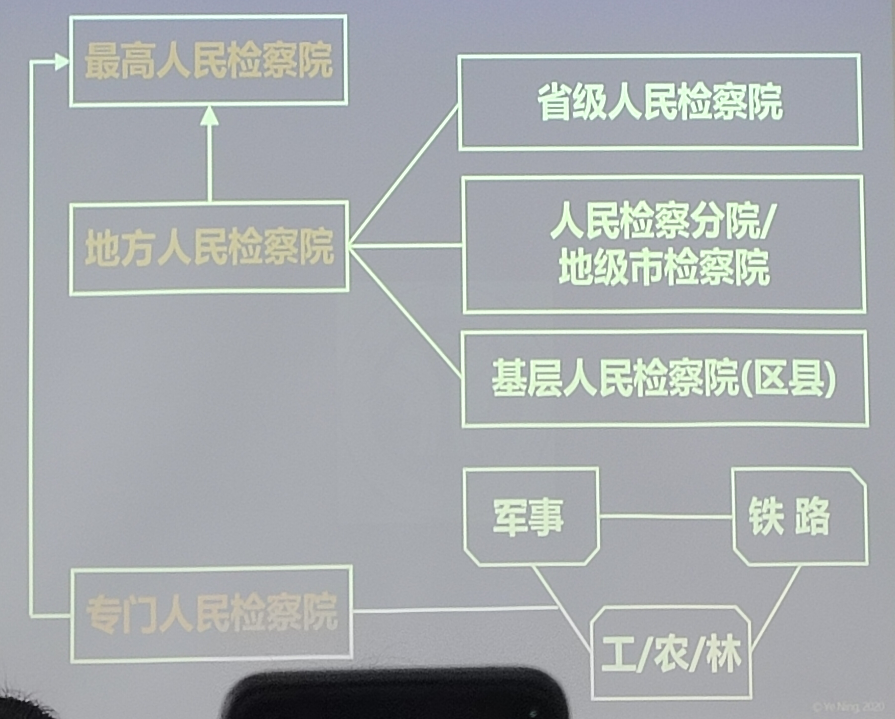
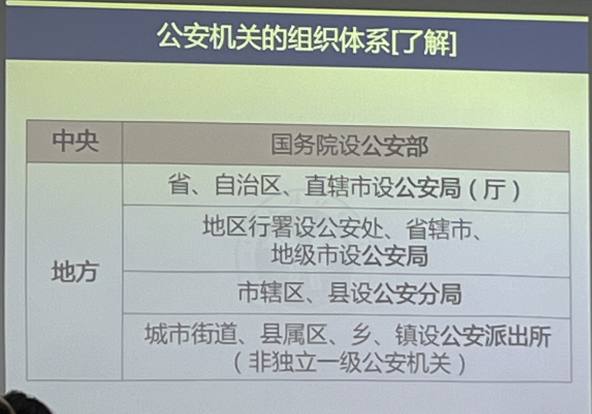

# 诉讼主体

## 法院
1. 性质:人民法院是我国的审判机关，在刑事诉讼中代表国家行使审判权。
2. 人民法院是唯一有权确定被告人有罪和对被告人判处刑罚的机关
>《宪法》第123条:中华人民共和国人民法院是国家的审判机关

>《刑事诉讼法》第12条:未经人民法院依法判决，对任何人都不得确定有罪。
## 审判机关在刑事诉讼中的职权
- 裁判权
  - 实体&程序
- 诉讼指挥权
- 执行权
1. 决定适用**拘传、取保候审、监视居住和逮捕**等强制措施
2. 对该出庭而不出庭作证的证人有权强制其到庭、予以训诫和拘留;在审判过程中，必要时可以进行**勘验、检查、查封、扣押鉴定和查询、冻结**;
3. 对违反法庭秩序的行为进行警告、制止以及采取处罚措施;
4. 执行某些判决和裁定;
5. 对生效判决按照审判监督程序进行提审或者再审
## 我国司法制度

#### 最高人民法院
最高人民法院是我国的最高审判机关，监督各级人民法院和专门人民法院的工作。
最高人民法院根据法律规定管辖的第一审刑事案件是全国性的重大刑事案件，同时，受理不服高级人民法院、专门人民法院判决和裁定的上诉、抗诉案件，以及依照审判监督程序提起的再审案件。
此外，最高人民法院还对审判工作中如何应用法律的问题作出有普遍拘束力的司法解释。
#### 巡回法院
>第二条 巡回法庭是最高人民法院派出的常设审判机构。巡回法庭作出的判决、裁定和决定是最高人民法院的判决、裁定和决定。

>第三条 巡回法庭审理或者办理巡回区内应当由最高人民法院受理的以下案件:
(一)全国范围内重大、复杂的第一审行政案件\
(二)在全国有重大影响的第一审民商事案件，\
(三)不服高级人民法院作出的第一审行政或者民商事判决、裁定提起上诉的案件\
(四)对高级人民法院作出的已经发生法律效力的行政或者民商事判决、裁定、调解书申请再审的案件;\
(五)刑事申诉案件;\
(六)依法定职权提起再审的案件;\
(七)不服高级人民法院作出的罚款、拘留决定申请复议的案件\
(八)高级人民法院因管辖权问题报请最高人民法院裁定或者决定的案件，\
(九)高级人民法院报请批准延长审限的案件;\
(十)涉港澳台民商事案件和司法协助案件\
(十一)最高人民法院认为应当由巡回法庭审理或者办理的其他案件

>《最高人民法院关于巡回法庭审理案件若干问题的规定》第四条 知识产权、涉外商事、海事海商、死刑复核、国家赔偿、执行案件和最高人民检察院抗诉的案件暂由最高人民法院本部审理或者办理。
#### 地方各级法院
地方各级人民法院分为基层人民法院、中级人民法院和高级人民法院。市辖区、县、自治县、县级市、旗设基层人民法院。基层人民法院可以根据需要设立人民法庭，人民法庭是基层人民法院的组成部分，其判决和裁定就是基层人民法院的判决和裁定。
#### 专门法院
军事法院的最高级别是**高级军事法院**，其上诉案件由最高人民法院受理。

铁路运输法院的最高级别是**中级法院**，其上诉案件由各省高级法院受理;将逐步改组为跨行政区划法院。

海事法院只负责海事海商案件审理，**无刑事案件管辖权**

知识产权法院(北、上、广)主要负责中院一级的知识产权**民事、行政**案件审理。
### 法院的上下级关系
## 审判组织
### (一) 独任庭
独任庭是由审判员一人独任审判案件的组织形式
- 优点:司法成本低、裁决迅速
- 缺点:容易导致恣意擅断。
>根据《刑事诉讼法》第178条的规定，独任审判只限于基层人民法院 适用简易程序、速裁程序进行第一审的刑事案件。
### (二) 合议庭
合议庭是由审判人员数人集体审判案件的组织形式
>《人民法院组织法》第9条规定:“人民法院审判案件实行合议制。

合议庭是人民法院审判案件的基本组织形式，除可以独任审判的第一审案件外，**其他案件均应由合议庭审判**。
##### 第一审刑事案件审理的合议庭组成
|法院层级|合议庭成员|合议庭人数|
|:---:|:---:|:---:|
|基层法院|审判员、陪审员|3|
|中级法院|审判员、陪审员|3、7|
|高级法院|审判员、陪审员|3、7|
|最高法院|审判员、陪审员|3、7|
- **第二审案件**:由审判员**3人、5人**组成合议庭进行
- **复核死刑案件**:由审判员**3人**组成合议庭进行，
- **审判监督程序重审案件**:应当分别依照第一审或第二审程序的有关规定**另行**组成相应的合议庭。
### (三) 审判委员会
作为对审判工作实行集体领导的组织形式，审判委员会是我国法院内部独有的一种组织形式。
>根据《刑事诉讼法》第180条的规定，对于**疑难、复杂、重大**的案件，合议庭认为难以作出决定的，由合议庭提请院长决定提交审判委员会讨论决定

>最高法《刑诉法解释》178条:拟判处**死刑**的案件、人民检察院抗诉的案件，合议庭应当提请院长决定提交审判委员会讨论决定。\
对合议庭成员意见有重大分歧的案件、新类型案件、社会影响重大的案件以及其他疑难、复杂、重大的案件，合议庭认为难以作出决定的，可以提请院长决定提交审判委员会讨论决定。人民陪审员可以要求合议庭将案件提请院长决定是否提交审判委员会讨论决定。\
对提请院长决定提交审判委员会讨论决定的案件，院长认为不必要的，可以**建议合议庭复议一次**。\
**独任审判的案件**，审判员认为有必要的，也可以提请院长决定提交审判委员会讨论决定。

审判委员会通常是由院长、副院长、庭长和少数有审判经验的审判员组成，其委员由院长提请本级人民代表大会常务委员会任免。审判委员会评议案件采用会议的方式，由院长主持，院长因故不能主持时，可以委托副院长主持。审判委员会实行民主集中制。

本级人民检察院**检察长可以列席审判委员会会议**，对讨论事项可以发表意见，但不参加表决。

审判委员会讨论案的情况和决定，应当制作笔录，并由参加讨论的审判委员会委员签名。

审判委员会的多数人意见就是审判委员会的意见，合议庭应当据以作出判决或裁定，但判决书上的署名应当是审理该案的合议庭成员，而非审判委员会的委员
### (四) 人民陪审员制度
从世界范围看，现代各国普遍确立了吸纳普通公民参与刑事审判的制度。

主要表现为两种类型一种是英美法系国家的陪审制;另一种则是大陆法系国家的参审制

我国人民陪审员制度与大陆法系国家的参审制较为类似。

##### 陪审制最大的价值何在?
陪审制最大的价值是确保司法权的民主性，防止国家生杀予夺的权力掌握在少数不食人间烟火的精英阶层手中。

因此，各国陪审制的设计中，陪审员都被要求由“法律外行”担任，他们仅仅服从良心和道德，依据良知和生活经验对案件事实进行裁断，负责认定案件事实而不负责法律适用。

通俗而言，无论大陆法系还是英美法系，陪审员都被普遍要求“越接地气越好”，只需朴素的法律观，不需要甚至不能具备十分专业的法律知识。
#### 人民陪审员的名额
>第八条 人民陪审员的名额，由基层人民法院根据审判案件的需要，提请同级人民代表大会常务委员会确定。

人民陪审员的名额数不低于本院法官数的三倍
#### 人民陪审员的选任机制(随机选任+推荐)
>第九条 司法行政机关会同基层人民法院、公安机关，从辖区内的常住居民名单中**随机抽选**拟任命人民陪审员数**五倍以上**的人员作为人民陪审员**候选人**，对人民陪审员候选人进行资格审查，征求候选人意见。

>第十条 司法行政机关会同基层人民法院，从通过资格审查的人民陪审员候选人名单中**随机抽选**确定人民陪审员人选，由基层人民法院院长提请同级人民代表大会常务委员会任命。

>第十九条 基层人民法院审判案件需要由人民陪审员参加合议庭审判的，应当在人民陪审员名单中**随机抽取确定**。

中级人民法院、高级人民法院审判案件需要由人民陪审员参加合议庭审判的，在其辖区内的基层人民法院的人民陪审员名单中随机抽取确定

>第十一条，因审判活动需要，可以通过**个人申请**和所在单位、户籍所在地或者经常居住地的基层群众性自治组织、人民团体**推荐**的方式产生人民陪审员候选人，经司法行政机关会同基层人民法院、公安机关进行资格审查，确定人民陪审员人选，由基层人民法院院长提请同级人民代表大会常务委员会任命。

>依照前款规定产生的人民陪审员，不得超过人民陪审员名额数的五分之一。
#### 人民陪审员的任期
>第十二条 人民陪审员经人民代表大会常务委员会任命后应当公开进行就职宣誓。宣誓仪式由基层人民法院会同司法行政机关组织。

>第十三条 人民陪审员的**任期为五年，一般不得连任**。
#### 人民陪审员的选任资格
##### 积极条件
>第五条，公民担任人民陪审员，应当具备下列条件:
(一)拥护中华人民共和国宪法\
(二)年满二十八周岁;\
(三)遵纪守法、品行良好、公道正派;\
(四)具有正常履行职责的身体条件

担任人民陪审员，一般应当具有高中以上文化程度。
##### 消极条件
>第六条，下列人员不能担任人民陪审员
(一)人民代表大会常务委员会的组成人员，监察委员会、人民法院人民检察院、公安机关、国家安全机关、司法行政机关的工作人员\
(二)律师、公证员、仲裁员、基层法律服务工作者\
(三)其他因职务原因不适宜担任人民陪审员的人员。

>第七条 有下列情形之一的，不得担任人民陪审员
(一)受过刑事处罚的，\
(二)被开除公职的;\
(三)被吊销律师、公证员执业证书的\
(四)被纳入失信被执行人名单的;\
(五)因受惩戒被免除人民陪审员职务的;\
(六)其他有严重违法违纪行为，可能影响司法公信的，
#### 适用人民陪审员审判的一审案件
>刑诉法第13条:人民法院审判案件，依照本法实行人民陪审员陪审制度。

>《人民陪审员法》第14条 人民陪审员和法官组成合议庭审判案件由法官担任审判长，可以组成**三人合议庭**，也可以由法官三人与人民陪审员四人组成**七人合议庭**。

>第15条 人民法院审判第一审刑事、民事、行政案件，有下列情形之一的，由人民陪审员和法官组成合议庭进行:
(一)涉及群体利益、公共利益的，\
(二)人民群众广泛关注或者其他社会影响较大的,\
(三)案情复杂或者有其他情形，需要由人民陪审员参加审判的。人民法院审判前款规定的案件，法律规定由法官独任审理或者由法官组成合议庭审理的，从其规定。

>《人民陪审员法》第16条 人民法院审判下列第一审案件由人民陪审员和法官组成七人合议庭进行:
(一)可能判处**十年以上有期徒刑、无期徒刑、死刑，社会影响重大的刑事案件**:\
(二)根据民事诉讼法、行政诉讼法提起的公益诉讼案件，\
(三)涉及**征地拆迁、生态环境保护、食品药品安全，社会影响重大的案件**;\
(四)其他社会影响重大的案件。

>2021年最高法《刑诉法解释》第213条第2款
基层人民法院、中中级人民法院、高级人民法院审判下列第一审刑事案件，由**审判员和人民陪审员组成七人合议庭**进行:\
(一)可能判处**十年以上**有期徒刑、**无期**徒刑、**死刑**，**且社会影响重大**的;\
(二)涉及**征地拆迁**、**生态环境保护**、**食品药品安全**，且**社会影响重大**的;\
(三)其他社会影响重大的。
#### 人民陪审员的职权
>人民陪审员依法享有参加审判活动、独立发表意见、获得履职保障等权利。但陪审员**不能担任合议庭审判长**。(《陪审员法》第14条)

人民陪审员和法官组成合议庭审判案件，可以组成三人合议庭，也可以由法官三人与人民陪审员四人组成七人合议庭。
>审判长应当履行与案件审判相关的指引、提示义务，**但不得妨碍人民陪审员对案件的独立判断**。合议庭评议案件，审判长应当对本案中涉及的事实认定、证据规则、法律规定等事项及应当注意的问题，向人民陪审员进行必要的解释和说明。(《陪审员法》第20条)

人民陪审员参加三人合议庭审判案件，对事实认定、法律适用，独立发表意见，**行使表决权**。人民陪审员参加七人合议庭审判案件，对事实认定，独立发表意见，并与法官共同表决;**对法律适用，可以发表意见，但不参加表决**。
### 刑事诉讼中的检察机关
1. 性质:
>国家的法律监督机关，代表国家行使检察权(《宪法》第129条)
2. 职权：维护法律统一、直接受理的刑事案件进行侦查:对公安机关侦查的案件实施审查，决定是否批准逮捕、起诉不起诉;出庭支持公诉;对侦查、审判、刑罚执行过程是否合法进行监督。
#### 检察机关在刑事诉讼中的职权
1. **立案侦查权**，即有权对司法工作人员特定案件立案侦查
2. **公诉权**，即对侦查终结的案件审查起诉进而作出提起公诉不起诉或者附条件不起诉的决定等。
3. 启动违法所得的没收程序和强制医疗程序等特别程序的权力。
4. **诉讼监督权**，即有权对整个刑事诉讼活动开展的合法性进行监督。
5. 司法救济权，即有权在当事人、辩护人、诉讼代理人及其利害关系人遭遇公安司法机关及其工作人员违法采取的强制措施或者侦查措施时为其提供救济。
#### 检察机关的组织体系及其上下级关系
人民检察院的组织体系如下:中央设最高人民检察院，省、自治区、直辖市设人民检察院，省辖市、地、州、盟设人民检察院或人民检察院分院，市辖区、县、自治县、县级市、旗设人民检察院。

省一级和县一级人民检察院根据工作需要，提请本级人民代表大会常务委员会批准，可以在工矿区、农垦区、林区等区域设置人民检察院作为派出机构。

#### 检察院的组织体系
检察机关上下一体(**检察一体化**)

上级领导下级、除最高检(及专门检察院)之外，下级检察院受上级检察院和同级人大及其常委会的领导/监督(**双重领导**)

上级检察院有权对具体案件如何处理向下级检察院发布具有约束力的批示和指令，下级检察院应当执行(**上命下从**)
#### 检察院内部组织关系
实行**检察长负责制**

检察长领导工作、检察委员会在检察长主持下开展工作
>《人民检察院组织法》第32条：检察委员会会议由检察长或者检察长委托的副检察长主持。检赛委员会实行民主集中制。

地方各级人民检察院的检察长不同意本院检察委员会多数人的意见，属于办经家件的，可以根请上一级人民检察院决定，即于面大研项的，可以报请上一级人民检察院或者本级人民代表大会常务委员会决定
#### 检察官的任免
1. 任职资格:
>初任检察官采用考试、考核的办法，按照德才兼备的标准，从通过国家统一法律职业资格考试取得法律职业资格并且具备检察官条件的人员中择优提出人选。(《检察官法》第13条-2017年9月1日最新修改)
2. 检察官的任免

|最高人民检察院检察长|全国人民代表大会|
|---|---|
|副检察长、检察委员会委员、检察员|检察长提请全国人大常委会任免|
|地方各级检察院检察长|同级人大任免|

### 刑事诉讼中的公安机关
#### 公安机关的组织体系

##### 派出所独立侦查权
1. 有独立侦查权：简单、轻微
~~~
“两抢一盗”、简单轻微的人身伤害案件
~~~
2. 无独立侦查权：
   1. 命案或疑似命案
   2. 毒品类案件(制毒贩毒类案件)(吸、容留、持有少量派出所可以独立处理)
   3. 其他重大案件(比较大的经济犯罪)
#### 公安机关的性质
“司法机关的外延”
#### 公安机关的职权
|职权|内容|
|---|---|
|立案侦查|依法管辖案件立案，询问证人、被害人、勘验、检查、搜查、扣押、查询、冻结、鉴定、**辨认、侦查实验、技术侦查、通缉**等侦查措施
|
|强制措施|拘传、拘留、取保候审、监视居住决定权,提请批准逮捕，执行逮捕和监视居住|
|撤销案件|不应追究刑事责任的，撤销案件|
|移送审查起诉|侦查终结，符合起诉条件的移送检察院审查起诉|
|复议复核|对检察院不批准逮捕、不起诉决定，有权要求原机关复议，或进一步提请上级检察院复核|
|生效裁判执行|拘役、剥夺政治权利、剩余刑期3个月以下的有期徒刑|
|特别程序中职权|未成年犯罪嫌疑人通知法律援助、刑事和解协议书、没收财产意见书、强制医疗意见书|
#### 其他有侦查职权的专门机关
|机关|侦查职权|
|---|---|
|公安机关|绝大部分犯罪案件|
|检察院|司法机关工作人员利用职务进行的特定犯罪案件|
|国家安全机关|办理危害国家安全的刑事案件，行使与公安机关相同的职权|
|军队保卫部门|对军队内部发生的刑事案件行使侦查权|
|监狱|对罪犯在监狱内犯罪案件行使侦查权|
|**中国海警局**|履行海上维权执法职责，对海上发生的刑事案件行使侦查权|
###### 中国海警局的组建及其职权
#### 国家监察委员会的机关属性
2017年11月6日新华社刊发长通讯《国家监察体制改革试点工作综述》，其中特别提出:
>“准确把握监察委员会的定位。**明确监察委员会实质上就是反腐败工作机构**，和纪委合署办公，代表党和国家行使监督权，**是政治机关，不是行政机关、司法机关**。”
### 国家监察委员会设置与职权
>第十一条 监察委员会依照本法和有关法律规定履行监督、调查、处置职责:\
(一)对公职人员开展廉政教育，对其依法履职、公用权、廉洁从政从业以及道德操守情况进行监督检查;、
(二)对涉嫌贪污贿赂、滥用职权、玩忽职守、权力寻租、利益输送徇私舞弊以及浪费国家资财等职务违法和职务犯罪进行调查、
(三)对违法的公职人员依法作出政务处分决定，对履行职责不力失职失责的领导人员进行问责:对涉嫌职务犯罪的，将调查结移送人民检察院依法审查、提起公诉;向监察对象所在单位提出监察建议