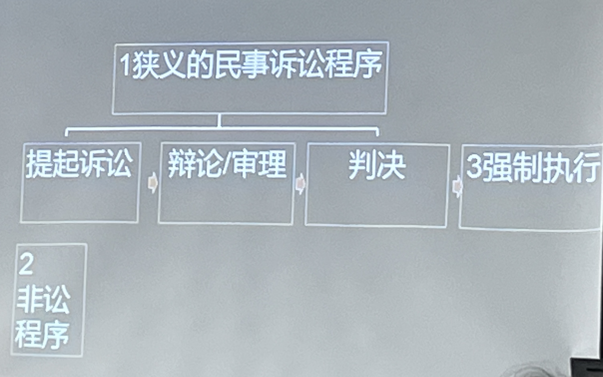

# 导论 民事诉讼法之入门
###### 民事诉讼的基本概念
###### 民事诉讼的产生背景
###### 民事诉讼的“目的”

### 一、基本概念
为了实现私权而制定的国家公权性程序
### 二、国家为什么要设置民事诉讼程序?
- “人类历史是一部冲突史”
- 放任私力救济的危害
1. 防止债务奴隶制的泛滥
2. 防止法和社会秩序的崩溃
### 三、逻辑的必然结果
1. 国家机关独占审判权
>第一百二十八条 中华人民共和国人民法院是国家的审判机关。
2. 国家保障人民的诉权(司法保护的责任与相应的请求权)
   1. 接近司法的权利
   2. 正式程序中接受审理
   3. 有约束力的法院裁判
3. 特殊的自助、自卫行为被法律允许，同时，某些**替代性纠纷解决方案(ADR)**成为诉讼的**有益补充**
   1. 当事人自决与和解
   2. 自治性社会群体、组织平息纠纷
   3. 公权力组织依职权处理纠纷
   4. 人民调解委员会调解
   5. 仲裁委员会仲裁