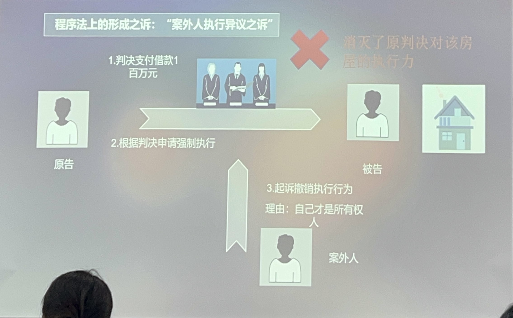
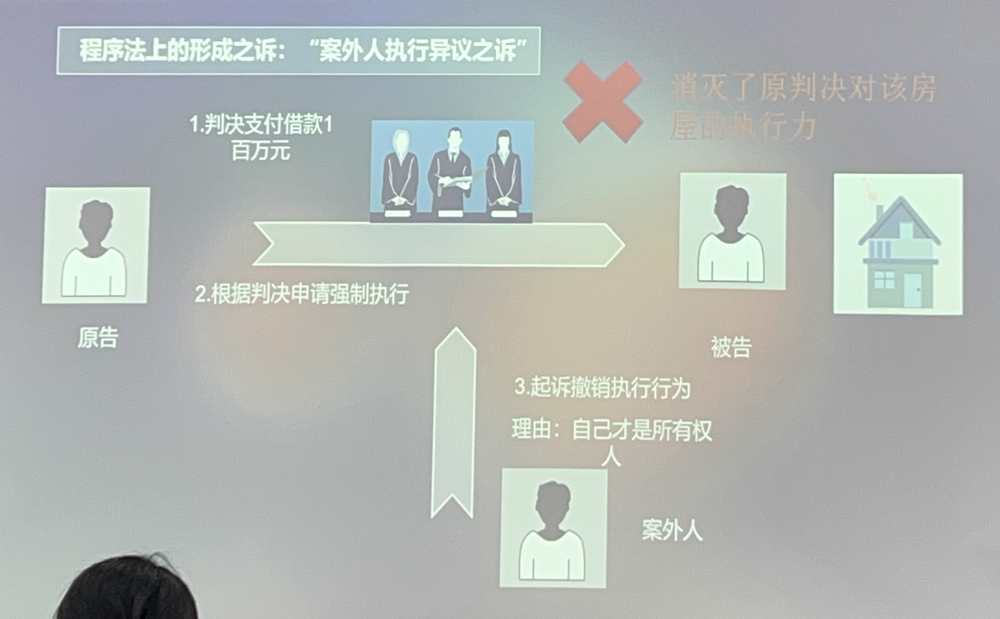
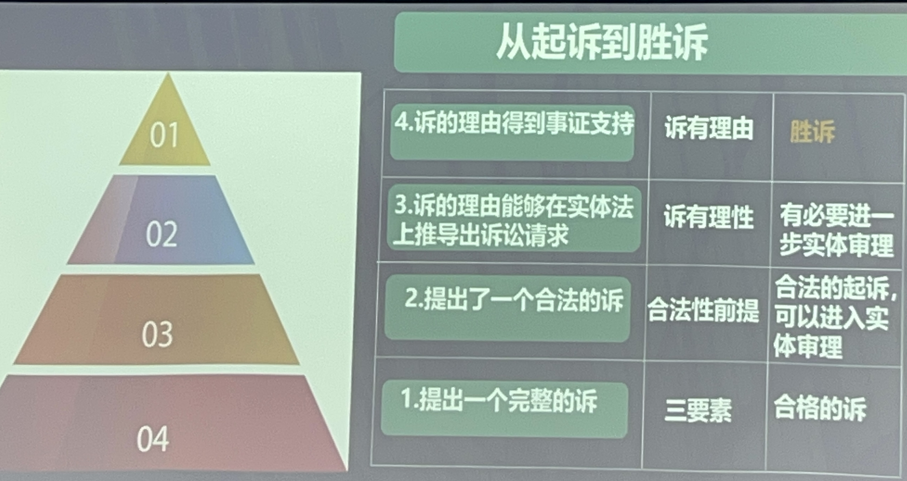

# 民事诉讼的基本理论
# 一、诉的概念
当事人向法院提出的针对其权利主张进行裁判的请求
1. 权利主张
   - 对于作为判决根据的实体法律关系的主张
2. 判决要求
   - 与权利主张相配合的一定的判决要求
# 三、诉(合法提起所必备)的三要素
1. 当事人
   1. 提起诉讼之人(原告)
   2. 被提起诉讼之人(被告)
2. 诉讼标的
   1. 裁判的对象
3. 诉的理由
   1. 当事人请求保护期权益的根据
   2. 事实理由
   3. 法律理由(不是必须的) 
- 有关诉的理由的“具体化理论”
  - 必须给出至少能够使得请求特定化的事实(能够界定此诉和彼诉)
- 有关诉的理由的“证成化理论”
  - 必须给出至少能够使得请求有理性的事实

诉不具体→不能合法受理

诉无理性→判决驳回诉讼请求
>第五十四条 诉讼请求的放弃、变更、承认、反驳及反诉：原告可以放弃或者变更诉讼请求。被告可以承认或者反驳诉讼请求，有权提起反诉。
# 四、(按照请求内容来划分)诉的类型
## 给付之诉
针对被告**实现**其在民法上关于**作为**或者**不作为**的请求权
1. 返还物
2. 给付金钱
3. 作出意思表示
4. 停止侵害
- 给付之诉
  1. 现实的给付之诉
  2. 将来的给付之诉
>《民法典》第一千零八十五条 离婚后，子女由一方直接抚养的，另一方应当负担部分或者全部抚养费。负担费用的多少和期限的长短，由双方协议；协议不成的，由人民法院判决。
## 确认之诉
对于**当下**的**法律关系**的**存在**(积极的确认之诉)或者**不存在**(消极的确认之诉)进行确认的请求
1. 确认的对象不能是过去的法律关系
2. 不能**仅仅**是抽象的法律问题、法律关系的前提问题(如意思表示是否有效)
3. 不能进**仅仅**是事实
4. 可以是具体的权利、义务
### 确认之诉的“即时确认利益”
- 合法地提起确认之诉的前提是:原告对于法律关系的存在或不存在有**利害关系**，即“法律上的利益”
- 如果能够提起给付诉讼，而仅提出确认之诉的，原则上不具有确认利益。
- 但是，由于债权**数额尚未确定或者暂时难以计算**，允许先确认基础法律关系。
## 形成之诉
- 通过法院裁判来形塑(**变更、消灭、创设**)现存法律关系的请求
- 通常是法定的
- 可以分为**实体法的形成之诉**、**程序法的形成之诉**
~~~
离婚诉讼，变更判决之诉(变更抚养费)，执行异议之诉，再审之诉
~~~
#### 程序法上的形成之诉:“案外人执行异议之诉”

#### 程序法上的形成之诉:“再审”

# 五、诉的合法性
只有提起合法之诉，法院才可以作出关于实体法律关系或权利之判决(实体裁判)。反之，则只能裁定**驳回起诉、不予受理**(程序裁判)

## 诉的合法性要件--简称诉讼要件
- 审查方式:是程序性事项，由法院**依职权调查**。
- 通常有三类
  1. 与诉讼标的有关
     1. 合法起诉
     2. 法律保护利益
     3. 既判力
     4. 重复起诉
  2. 与当事人有关
     1. 当事人能力
     2. 诉讼能力
     3. 诉讼实施权
  3. 与法院有关
     1. 主管
     2. 管辖
### 与法院有关的诉讼要件
1. 主管：人民法院作为一个整体，对于该民事纠纷具有审判权
2. 管辖权：按照人民法院内部的分工，诉所提交的人民法院对于该民事纠纷具有审判权
### 与当事人有关的诉讼要件
#### 当事人能力(民事诉讼权利能力)
能够成为民事诉讼当事人，享有民事诉讼权利和承担民事诉讼义务的法律资格
- 一般而言，不有民事权利能力者，亦有当事人能力。包括自然人、法人。但是，**部分不具有民事权利能力的主体，也可以例外**具有当事人能力。
>第五十八条 对污染环境、侵害众多消费者合法权益等损害社会公共利益的行为，法律规定的机关和**有关组织**可以向人民法院提起诉讼。

>第五十一条 公民、法人和**其他组织**可以作为民事诉讼的当事人
##### 依法设立/登记的“其他非法人姐织”
>《民诉法解释》第五十二条规定的其他组织是指合法成立，有一定的组织机构和财产但又不具备法人资格的组织，包括\
(一)依法登记领取营业执照的个人独资企业\
(二)依法登记领取营业执照的合伙企业:\
(三)依法登记领取我国营业执照的中外合作经营企业、外资企业\
(国)依法成立的社会团体的分更机构、代表机构\
(五)依法设立并领取营业执照的法人的分支机构\
(六)依法设立并领取营业执照的商业银行、政策性银行和非银行金融机构的分支机构\
(七)经依法受记领取营业执照的乡镇企业、街道企业\
(八)其他符合本条规定条件的组织。

依法设立、依法成立、登记、领取营业执照
>第六十条 在诉讼中，未依法登记领取营业执照的个人合伙的全体合伙人为共同诉讼人。个人合伙有依法核准登记的字号的，应在法律文书中注明登记的字号。全体合伙人可以推选代表人；被推选的代表人，应由全体合伙人出具推选书。

>第六十二条 下列情形，以行为人为当事人：\
（一）法人或者其他组织应登记而未登记，行为人即以该法人或者其他组织名义进行民事活动的；\
（二）行为人没有代理权、超越代理权或者代理权终止后以被代理人名义进行民事活动的，但相对人有理由相信行为人有代理权的除外；\
（三）法人或者其他组织依法终止后，行为人仍以其名义进行民事活动的。
#### 诉讼能力(诉讼行为能力)
当事人亲自进行诉讼活动，以自己的行为行使诉讼权利和承担诉讼义务的法律资格
- 只对自然人才有意义
- 完全民事行为能力人→有诉讼能力
- 限制民事行为能力人、无民事行为能力人→没有诉讼能力

缺乏诉讼能力的人，仍然可以作为当事人，只是其不能亲自进行诉讼，必须由代理人为之
#### 诉讼实施权(当事人适格;正当当事人)
在具体的诉讼中，作为本案当事人起诉或者应诉的资格。

在诉讼中以自己的名义主张某项实体法律关系、实体法请求权，或者对其进行防御的资格。
1. 实体权利归属说
   1. 作为诉讼标的的法律关系或权利义务关系的归属
2. 管理处分权说
   1. 对作为诉讼标的的法律关系或权利义务的“管理处分权”
3. 法律利益说
   1. 对诉讼结果有重大利益
4. 纠纷管理权说
   1. 对某一纠纷有所谓“纠纷管理权”
#### 诉讼当事人与实体权利义务主体的分离
第三人不是作为诉讼标的的实体法律关系、实体法权利义务的实际归属者,而作为本案的当事人。
~~~
遗产、破产等管理人
股东代表诉讼的股东
死者近亲属
系争物的让与人
公益诉讼的原告
~~~