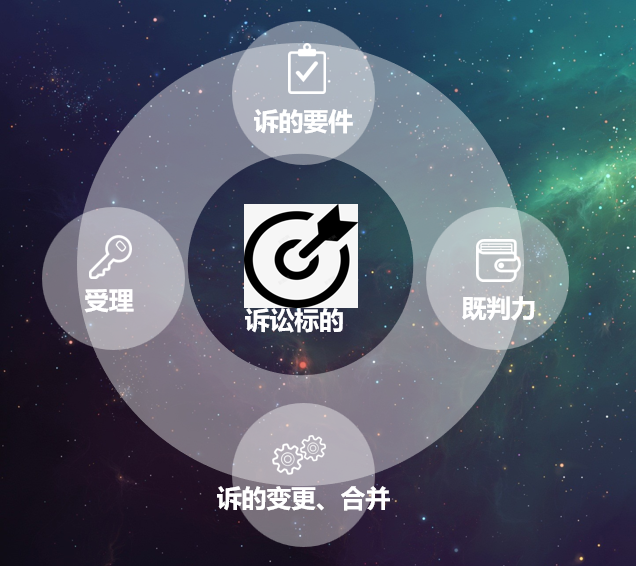
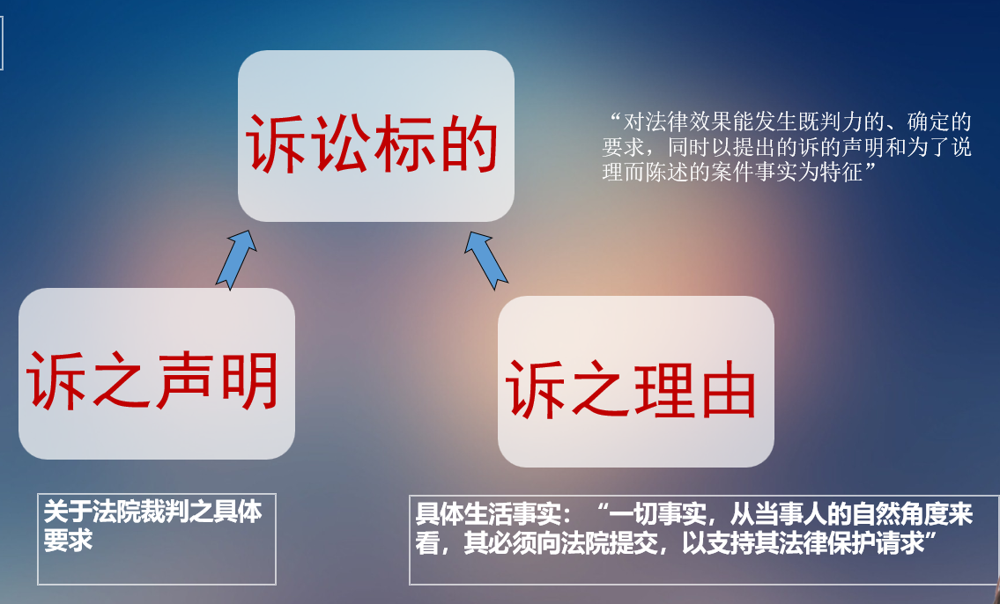
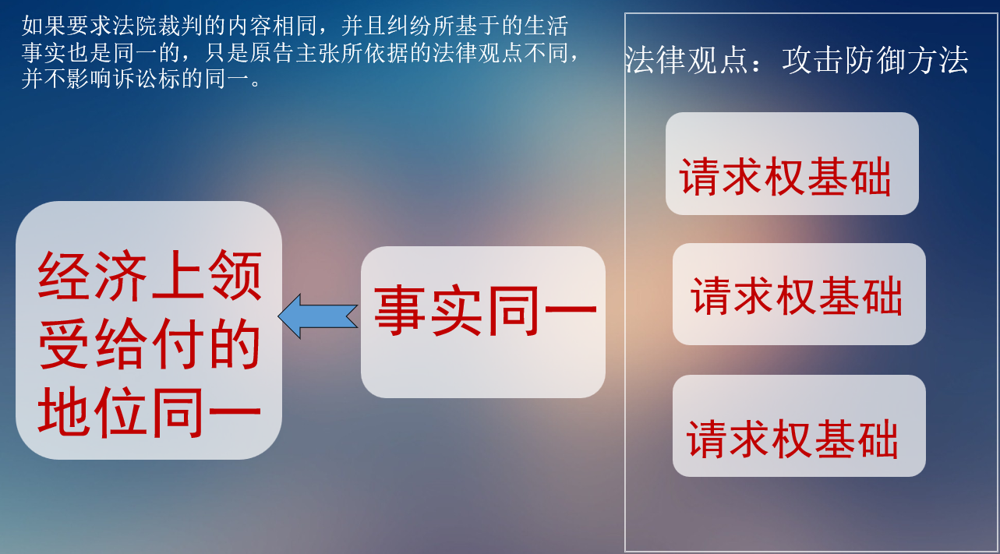
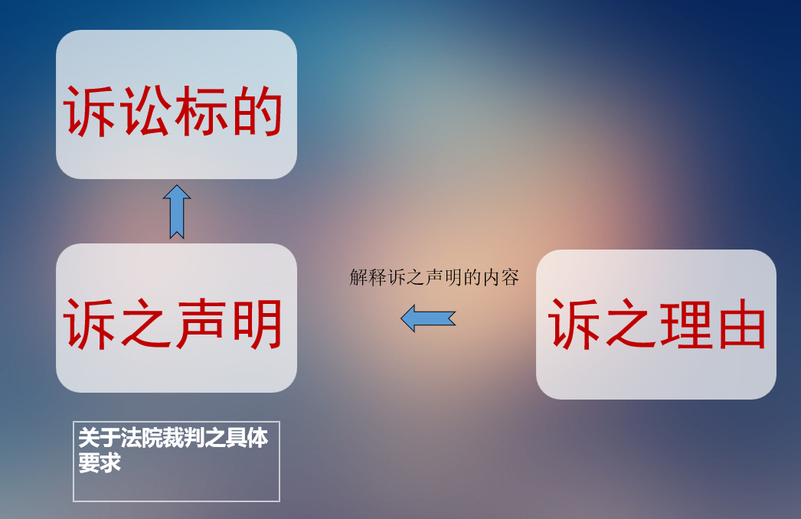
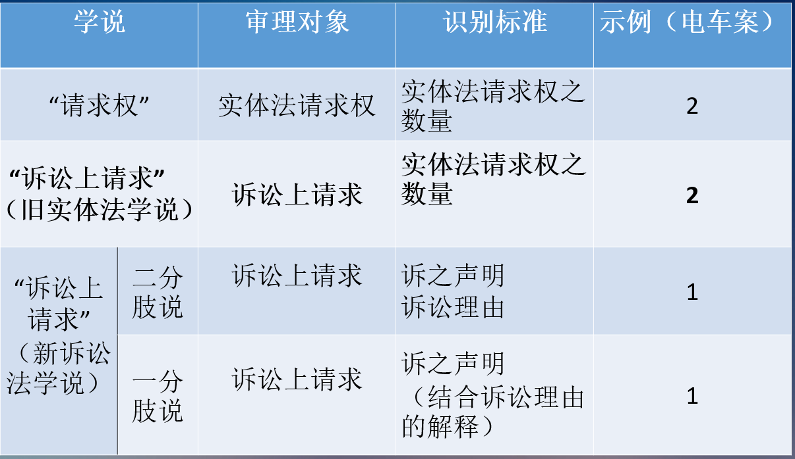

# 诉讼标的
# 诉讼标的之功能

1. 明确是否构成重复起诉 
2. 判断相应的诉讼要件
3. 判断生效判决的既判力范围
4. 判断诉的变更
- 诉讼标的是审理的对象，其变化，则审理对象、范围、方向均变化，可谓动一发而牵全身
# “请求”的产生历史
## 请求权的前身：actio
- actio是寻求司法官保护的程序行为/行动
- 在罗马法上，存在着大量的actio。例如，买物之诉（actio empti）、-诈欺之诉（actio de dolo）
- 罗马的行政官可以通过谕令、告示等方式，授予新的actio
- 没有actio,就不能启动相应的诉讼
### 罗马法的程式诉讼
1. 程式：法律审(诉因、请求、判决形式、抗辩、否认、再抗辩)
2. 《程式》及审理对象确定：争点确定
3. 举证调查：裁判审
- 只有法ius，而相对缺乏主观权利的观念
- 注重形式，能否获得司法救济取决于此
- 程序法和实体法没有明确的区分界限
## 请求权的产生(actio概念的分裂和剥离)
1. (私法上的)主观权利观念产生

萨维尼认为，主观权利是个人所享有的意志力，而诉权则是权利受到侵害时所发展出来的“防御状态”。
将诉权理解为两个阶段，即主观权利的存续和损害的发生。诉权的内容被理解为受害方要求加害方消除损害，这完全是实体法上的含义
请求权＝诉讼标的
2. 请求权被视为独立的权能
请求权≠诉权
- actio是请求权（Anspruch）的表达
#### actio是权利的表现形式 
对于今天的法律观念来说权利是第一位的，而诉在其之后，权利是产生者，而诉是被产生者。法/权利分配给了每个个体它的支配范围，在这个范围内，它的意志对于其他个体来说就是法律。如果该个体不知道它的支配范围，那么就必须向国家——权利的守护者，进行申诉和起诉，而国家帮助它实现。法的秩序(Rechtsordnung)就是权利的秩序。
#### actio存在两种要素，即请求权与诉权 
actio是人们可以向他人要求之物的表达；如果我们为此进行概括，则可以说：actio是请求权（Anspruch）的表达。actio因此是请求权的替代物。某人有一个actio，意味着，用我们的法律观点的语言来说，可以向法庭追诉的特性是权利的后果，等于是说：某人有法/权承认的请求权。或者更确切：某人有请求权。
## 请求权作为诉讼标的古典“实体法理论”
请求权＝诉讼标的
- 识别标准：实体法请求权

但其存在Wach提出的问题：不能解释确认之诉
# “诉讼上的请求”——两大阵营诉讼标的理论的产生
## 诉讼上请求的概念产生
诉讼请求概念的产生是诉讼标概念的实体法色彩逐渐淡化、褪色的过程
- 诉权理论不能继续留在诉讼标的讨论中 

诉权，即法律保护请求权是针对国家的。
- 诉讼标的是诉讼上请求 

诉讼标的是被主张的实体权利：通过诉之声明（Klageantrag）指出的，向法院提出但针对对方当事人的诉讼上请求。
- 诉讼上请求是被主张的具体主观法/权利 
  1. 对于给付之诉，诉讼标的就是被主张的请求权；
  2. 对于确认之诉，诉讼标的就是被主张的权利或法律关系；
  3. 对于形成之诉，诉讼标的就是被主张的形成私权。
## 传统/旧实体法理论
请求权≠诉讼标的＝诉讼请求
- 识别标准：实体法请求权或实体法律关系、形成权
- 最接近我国目前的实务通说

在实体法理论的框架下，诉讼标的不是实体法请求权或者实体法律关系，却由实体法请求权或者实体法律关系来识别、界定。

1. 以实体法请求权来界定诉讼标的，导致纠纷解决的范围狭窄
2. 诉讼目的论的转变:纠纷解决说等观念的形成
3. 实体法请求权作为最小单位，**长期难以克服请求权竞合**的问题
### 大陆法关于诉讼标的的其他理论
1. 诉讼上请求是被主张的具体主观法/权利
2. （抽象的法律结果）的法律主张，原告要求对其作出有既判力的裁判 
3. 对于法律后果进行有既判力的确定的要求
## 诉讼法观点的诉讼标的理论
二分肢说与一分肢说
### 德国通说：二分肢说

|诉之声明|诉之理由|诉讼标的|
|:---:|:---:|:---:|
|一个|多个|多个|
|多个|一个|多个|
|一个|一个|一个|
### 一分肢说

### 诉讼标的相对化理论
1. 概念上：不再需要一个统一的诉讼标的标准
2. 功能上：由重复起诉、既判力、诉的变更具体制度去解决其各自的问题
3. 体系上：根据诉讼目的的不同，分别解决给付之诉、确认之诉、形成之诉的诉讼标的

# 两大阵营诉讼标的理论、我国司法解释的实例
1. 买方
   1. 基于买卖合同请求交付标的物
   2. 基于租赁关系请求返还租赁物
2. 卖方
   1. 买卖合同的价金请求
   2. 基于银行票据的清偿请求
# 诉的客观合并（多个诉讼标的纳入一个案件）
## 诉的客观合并的概念
原告在一个案件中提出多个诉讼请求（诉讼标的），法院将其在同一个案件内合并审理

1. 嗣后的合并
>第一百四十三条　原告增加诉讼请求，被告提出反诉，第三人提出与本案有关的诉讼请求，可以合并审理

1. 依职权合并
>第二百二十一条  基于同一事实发生的纠纷，当事人分别向同一人民法院起诉的，人民法院可以合并审理
## 诉的客观合并的类型
### 单纯的合并
原告在一个案件中提出多个平行的独立诉讼请求（诉讼标的），请求法院予以合并裁判
~~~
原告要求判令被告支付租赁合同到期后的租金500元，并且返还租赁物。
原告要求判令被告返还本金以及借款利息。
~~~
### 选择的合并
原告在一个案件中提出多个诉讼请求（诉讼标的），由法院择其一项或某项进行审理
~~~
原告要求判令被告支付500元，可以基于2020年春天的某天买卖合同，也可以基于2020年夏季的某项赠与合同
因为被告施工造成裂缝，原告要求判令被告支付120000元，可以基于侵权损害赔偿，也可以基于物权上因为忍受干扰的补偿（德民906）
~~~
### 预备合并
原告在一个案件中提出多个诉讼请求（诉讼标的），但由法院先审理其一项或某项（主请求），如果其不合法或者不能成立，则继续审理备位的请求。如果主请求得到支持，就不必再审备位请求（解除条件）

通常，主请求与备位请求有法律上或者经济上的相同目标。
~~~
原告要求判令被告支付买卖合同的价金500元，如果不能胜诉，则判令被告返还买卖标的物。
原告要求判令解除合同，但唯恐不能支持，预备请求减少价金。
~~~
### 非真正的预备合并：递进关系
原告在一个案件中提出多个诉讼请求（诉讼标的），但由法院先审理其一项或某项（主请求），如果其能够成立，则继续审理备位的请求。如果主请求得不到支持，当然也不必再审备位请求。
~~~
原告要求判令被告履行双方之间根据先合同约定的缔约义务，如果胜诉，则判令被告交付买卖标的物
~~~
## 诉的客观合并的结果
合并的审理、合并的裁判
# 四、诉的变更（诉讼标的变更）
如果要限制诉的变更。通常，以下变更是合法的，甚至不被视为真正的诉的变更：
1. 扩张或限缩诉的声明（诉讼请求）包括质、量的伸缩
~~~
请求判令被告支付10万元———请求判令被告支付5万元
~~~
2. 补充或者更正事实或法律上的陈述
~~~
请求确认被告对其的债权10万元———请求判令被告支付10万元
~~~
3. 起诉后产生或知悉的情事变更
~~~
请求判令被告返还标的物———起诉后该标的物起火灭失———损害赔偿
~~~
4. 有利于事案解决
~~~
请求之基础事实同一
~~~
5. 不碍于被告/被告同意