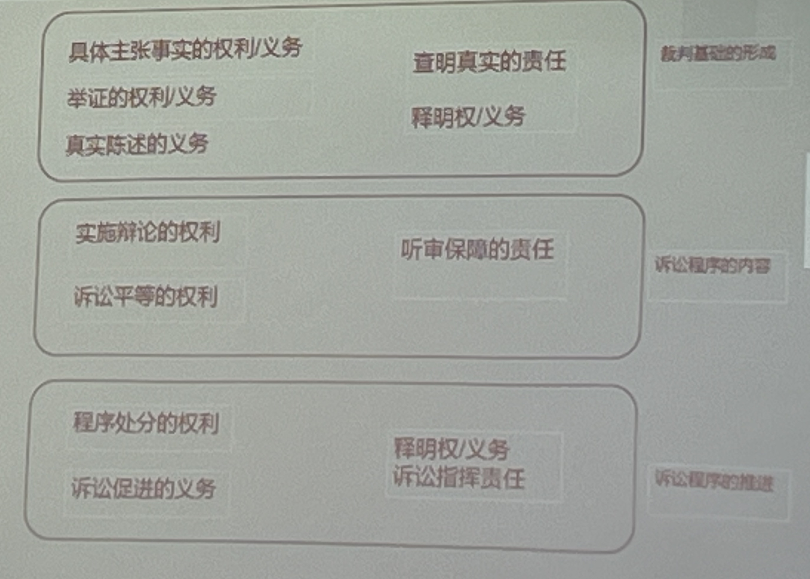
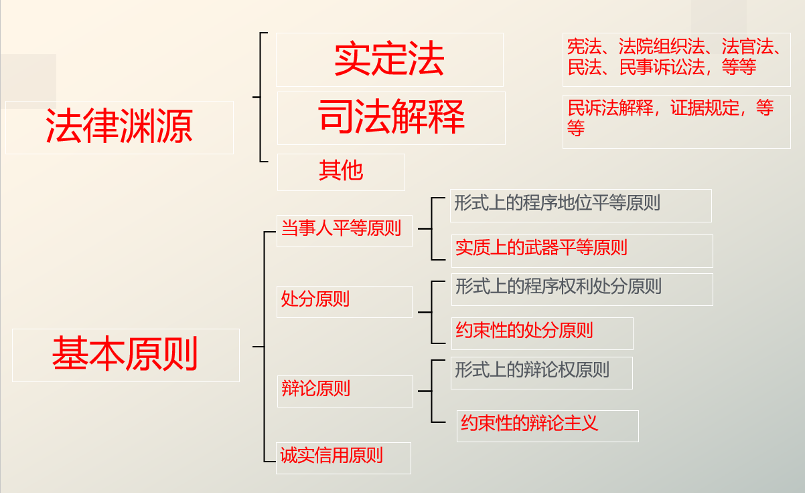
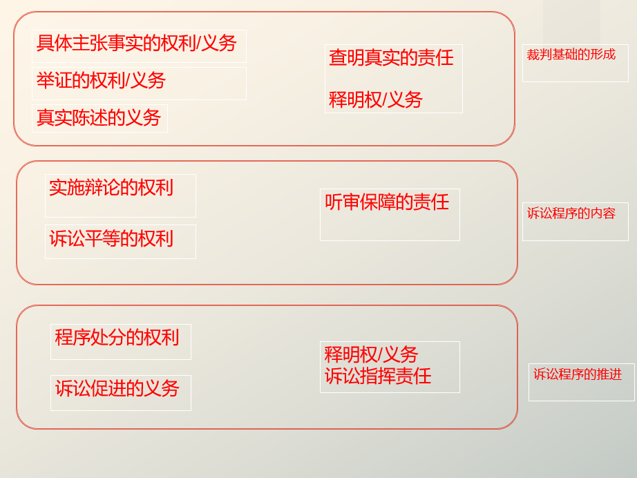

# 民事诉讼的法律渊源和基本准则

##### 目的论
1. 私权保障
2. 法秩序的维护
3. 纠纷的解决
# 一、法律渊源
1. 宪法
2. 法律
3. 司法解释
4. 我国加入的国际条约(保留除外)
5. 指导性案例、其他规范(?)
>第三十三条　凡具有中华人民共和国国籍的人都是中华人民共和国公民。\
中华人民共和国公民在法律面前一律平等。\
国家尊重和保障人权。\
任何公民享有宪法和法律规定的权利，同时必须履行宪法和法律规定的义务。

>第三十八条　中华人民共和国公民的人格尊严不受侵犯。禁止用任何方法对公民进行侮辱、诽谤和诬告陷害。

>第十三条　公民的合法的私有财产不受侵犯。\
国家依照法律规定保护公民的私有财产权和继承权。\
国家为了公共利益的需要，可以依照法律规定对公民的私有财产实行征收或者征用并给予补偿。
# 二、基本原则
1. 程序保障的根本精神
2. 平等原则
3. 处分原则
4. 辩论原则
5. 诚实信用原则
- 补充：法官释明权(义务)
## 人格尊严
当事人主体地位之程序/听审保障
辩论权：
>第十二条 人民法院审理民事案件时，当事人有权进行辩论。

民族语言
>第十一条 各民族公民都有用本民族语言、文字进行民事诉讼的权利。\
在少数民族聚居或者多民族共同居住的地区，人民法院应当用当地民族通用的语言、文字进行审理和发布法律文书。\
人民法院应当对不通晓当地民族通用的语言、文字的诉讼参与人提供翻译。
## 人人平等
1. 形式化的当事人平等原则(诉讼地位)
2. 实质的武器平等原则(攻击和防御手段)
当事人平等原则
>第八条 民事诉讼当事人有平等的诉讼权利。人民法院审理民事案件，应当保障和便利当事人行使诉讼权利，对事人在适用法律上一律平等。

注意同等原则与对等原则
>第五条 外国人、无国籍人外国企业和组织在人民法院起诉、应诉，同中华人民共和国公民、法人和其他组织有同等的诉讼权利义务外国法院对中华人民共和国公民、法人和其他组织的民事诉讼权利加以限制的，中华人民共和国人民法院对该国民、企业和组织的民事诉讼权利，实行对等原则
### 实质诉讼地位不平等的原因
1. 证据偏在
2. 诉讼能力悬殊
3. 新型现代纠纷

#### 武器平等原则
立法者和法官在规范各种案件的诉讼程序上，应尽可能的给予充分的信息以**增强攻防能力**尤其是应使双方拥有**同等攻防的机制**，此不仅涉及比例原则，也同属平等原则的适用。这些都构成了正当法律程序的内容。尤其是在法官的阐明权方面，显示出不论民事诉讼或刑事诉讼，都有武器平等原则之适用，也是关涉到平等权、法官中立的宪法原则。
1. 法官阐明(释明)义务之强化
2. 不负举证责任当事人一造之事案解明义务
3. 举证责任之合理分配
4. 证据保全机能之扩大
5. 当事人事证搜集开示之协力
## 民事诉讼中的处分原则
### (三大命题)
1. 启动程序
   1. 无诉无判
   2. 法院不得依职权启动审判
2. 审理内容
   1. 审理对象和审理范围由当事人决定
3. 终结程序
   1. 当事人有权以意思自治的方式终结诉讼
### 理解路径
1. 民法自治的投射
   1. 因为当事人有诚实信用地处分民事权利的自由，所以民事诉讼程序当然亦如此。
2. 程序法的独立价值
   1. 因为当事人是民事诉讼程序的主人
### 处分原则的边界
- 如果当事人原本就没有处分权，也就不能进行程序处分(身份关系、社会公益不允许处分)
## 约束性的辩论原则(主义)
1. 案件的主要事实由当事人主张
2. 不争议的事实，不需要举证
3. 争议的主要事实，由当事人举证
   1. 这里的由当事人举证，只要是当事人申请，就已经足够，未必需要现实地将证据以物理的方式交到法院
### “诉讼要件”
诉讼要件→实体判决
- 诉讼要件＊：也称为诉的合法性要件。如果缺乏该要件，法院不能依法作出实体判决，必须裁定驳回起诉或不予受理。换言之，它是法院行使审判权的重要前提。例如，法院的管辖权、当事人适格（有没有作为当事人的资格或者地位）、诉的利益（有没有利用诉讼解决纠纷的法律利益）
### 辩论主义的边界
1. 诚实信用原则(不能违反明知进行虚假陈述、隐瞒事实)
2. 职权调查事项:程序性事实如诉讼要件*的调查依职权启动(事实还是要当事人主张)
3. 职权探知主义:涉及公益，家事纠纷(婚姻、子女)的事实进行主动的调查和搜集证据
### 补充：法官的释明权
释明本质上是一种交流和讨论
>《证据规定》第二条 人民法院应当向当事人说明举证的要求及法律后果，促使当事人在合理期限内积极、全面、部分规定a正确、诚实地完成举证。\
当事人因客观原因不能自行收集的证据，可申请人民法院调查收集。

>第四条 一方当事人对于另一方当事人主张的于己不利的事实既不承认也不否认，经审判人员说明并询问后。其仍然不明确表示肯定或者否定的，视为对该事实的承认。

>第六十二条 人民法院根据当事人中请调查收集的证据，重判人员对调查收集证据的情况进行说明后，由提出中请的当事人与对方当事人、第三人进行质证。人民法院依职权调查收集的证据，由市判人员对调查收集证据的情况进行说明后，听取当事人的意见。

>第六十三条 当事人应当就案件事实作真实、完整的陈述。当事人的陈述与此前陈述不一致的，人民法院应当责令其说明理由，并结合当事人的诉讼能力、证据和案件具体情况进行审查认定。

>第八十五条 人民法院应当以证据能够证明的案件事实为根据依法作出判。审列人员应当依照法定程序，全面、客观地市核证据，依据法律的规定，遵循法官职业道德，运用逻辑推理和日常生活经验，对证据有无证明力和证明力大小独立进行判断，并公开判断的理由和结果。

>第九十七条，人民法院应当在被判文书中明证据是否采纳的理由

1. 发问
   1. 促进：当事人的攻防不充分
   2. 使其增加陈述、证据、申请
2. 说明
   1. 澄清：当事人不了解诉讼状态
   2. 将关于事案的事实或法律观点进行开示
3. 提高司法公正
   1. 人民能够信赖这样的裁判，减少因为攻防不充分造成的错案，发改
4. 防止突袭裁判
   1. 人民更容易接受这样的裁判，减少因为沟通不畅引起的申诉信访
## 诚实信用原则
>第十三条 民事诉讼应当边循诚实信用原则。

1. 当事人有完整和真实的陈述义务
2. 当事人不得**骗取**或**滥用**诉讼权利
3. 禁止反言
4. 当事人有诉讼促进的义务
### 刑事制裁
>《刑法》第三百零七条之一 【虚假诉讼罪】 以捏造的事实提起民事诉讼，妨害司法秩序或者严重侵害他人合法权益的，处三年以下有期徒刑、拘役或者管制，并处或者单处罚金；情节严重的，处三年以上七年以下有期徒刑，并处罚金
### 违反促进义务导致“失权”
>第六十八条 举证期限及逾期后果：当事人对自己提出的主张应当及时提供证据。\
人民法院根据当事人的主张和案件审理情况，确定当事人应当提供的证据及其期限。当事人在该期限内提供证据确有困难的，可以向人民法院申请延长期限，人民法院根据当事人的申请适当延长。当事人逾期提供证据的，人民法院应当责令其说明理由；拒不说明理由或者理由不成立的，人民法院根据不同情形可以不予采纳该证据，或者采纳该证据但予以训诫、罚款
### 不利的推定或评价
>《证据规定》第六十六条 当事人无正当理由拒不到场、拒不签署或宣读保证书或者拒不接受询问的，人民法院应当综合案件情况，判断待证事实的真伪。待证事实无其他证据证明的，人民法院应当作出不利于该当事人的认定。

>第九十五条 一方当事人控制证据无正当理由拒不提交，对待证事实负有举证责任的当事人主张该证据的内容不利于控制人的，人民法院可以认定该主张成立。

