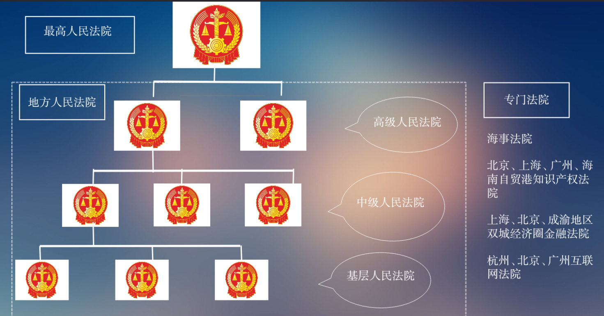
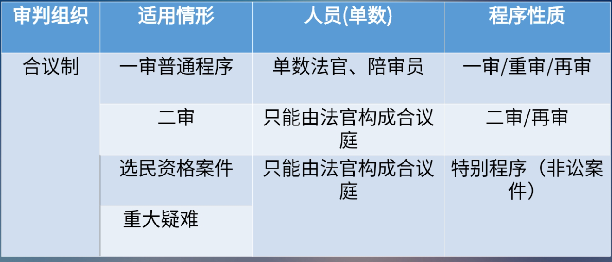
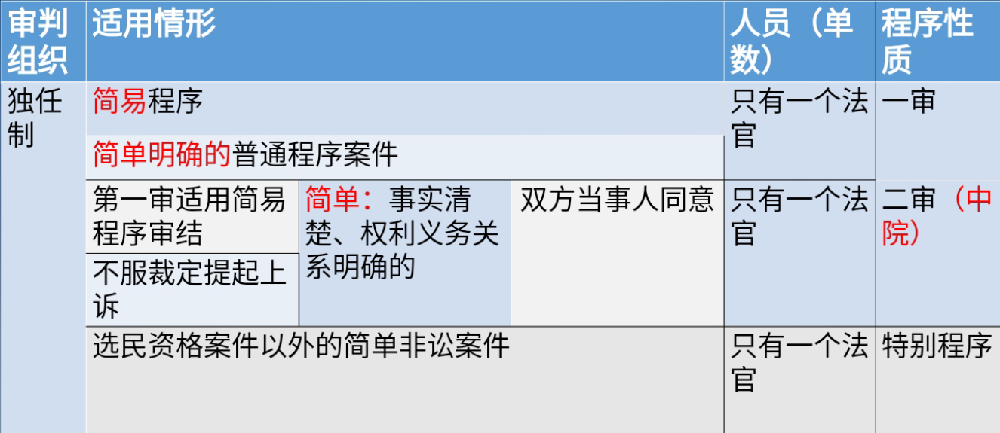
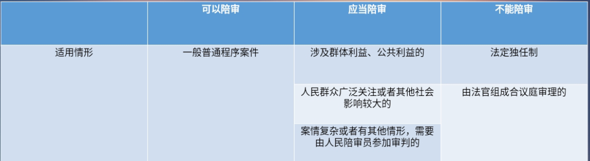

# 法院
# 一、审级制度
“四级两审终审制”

- 民事诉讼的审级原则:“两审终审制”
>第一百七十一条 当事人不服地方人民法院第一审判决的，有权在判决书送达之日起十五日内向上一级人民法院提起上诉。\
当事人不服地方人民法院第一审裁定的，有权在裁定书送达之日起十日内向上一级人民法院提起上诉
- 特殊审级例外:“一审终审制”
  1. 最高人民法院一审终审的民事案件
  2. 小额诉讼案件
  3. 特别程序审理的案件
### 小额诉讼案件
>第一百六十五条 基层人民法院和它派出的法庭审理事实清楚、权利义务关系明确、争议不大的简单金钱给付民事案件,标的额为各省、自治区、直辖市上年度就业人员年平均工资百分之五十以下的,适用小额诉讼的程序审理，实行一审终审。\
基层人民法院和它派出的法庭审理前款规定的民事案件,标的额超过各省、自治区、直辖市上年度就业人员年平均工资百分之五十但在二倍以下的，当事人双方也可以约定适用小额诉讼的程序。
1. 事实清楚、权利义务关系明确、争议不大
2. 金钱给付民事案件
3. 标的额较小;或者约定
##### 例外
1. 人身关系、财产确权案件
2. 涉外案件
3. 需要评估、鉴定或者对诉前评估、鉴定结果有异议的案件
4. 一方当事人下落不明的案件
5. 当事人提出反诉的案件
6. 其他不宜适用小额诉讼的程序审理的案件
# 二、审判组织
## (一) 合议制
1. 审判员：审判长、其他审判员
2. 陪审员：参与民事审理的公民
### 审判长的产生
1. 院庭长参审时自己担任
2. 院庭长指定
### 分类
1. 一审合议庭
>第四十条第一款 人民法院审理第-一审民事案件，由审判员、陪审员共同组成合议庭或者由审判员组成合议庭。。合议庭的成员人数，必须是单数
2. 二审合议庭
>第四十一条第一款 人民法院审理第二审民事案件，由审判员组成合议庭，合议庭的成员人数，必须是单数。
3. 重审合议庭=一审合议庭
>第四十一条第三款 发回重审的案件，原审人民法院应当按照第一审程序另行组成合议庭
4. 再审合议庭
>四十一条第四款 原审是一审,按照一审组成合议庭;原审是二审或提审,二审合议庭

## (二) 独任制
### 一审独任制
>第四十条第二款 适用简易程序审理的民事案件，由审判员一人独任审理。基层人民法院审理的基本事实清楚、权利义务关系明确的第一审民事案件，可以由审判员一人适用普通程序独任审理
### 二审独任制
>第四十一条第二款(2022年1月1日起施行修正) 中级人民法院对第一审适用简易程序审结或者不服裁定提起上诉的第二审民事案件，事实清楚、权利义务关系明确的，经双方当事人同意可以由审判员一人独任审理。

### 扩张独任制范围修法的“补丁”
>第四十二条 人民法院审理下列民事案件，不得由审判员一人独任审理\
(一) 涉及国家利益、社会公共利益的案件\
(二) 涉及群体性纠纷，可能影响社会稳定的案件\
(三)人民群众广泛关注或者其他社会影响较大的案件\
(四)属于新类型或者疑难复杂的案件\
(五)法律规定应当组成合议庭审理的案件\
(六)其他不宜由审判员一人独任审理的案件
### 转换合议制裁定
#### 独任制转换合议庭
>第四十三条 人民法院在审理过程中，发现案件不宜由审判员一人独任审理的，应当裁定转由合议庭审理。
#### 当事人异议
当事人认为案件由审判员一人独任审理违反法律规定的，可以向人民法院提出异议。人民法院对当事人提出的异议应当审查，异议成立的，裁定转由合议庭审理，异议不成立的，裁定驳回。
## (三) 陪审制
>第四十条第三款 陪审员在执行陪审职务时，与审判员有同等的权利义务。
