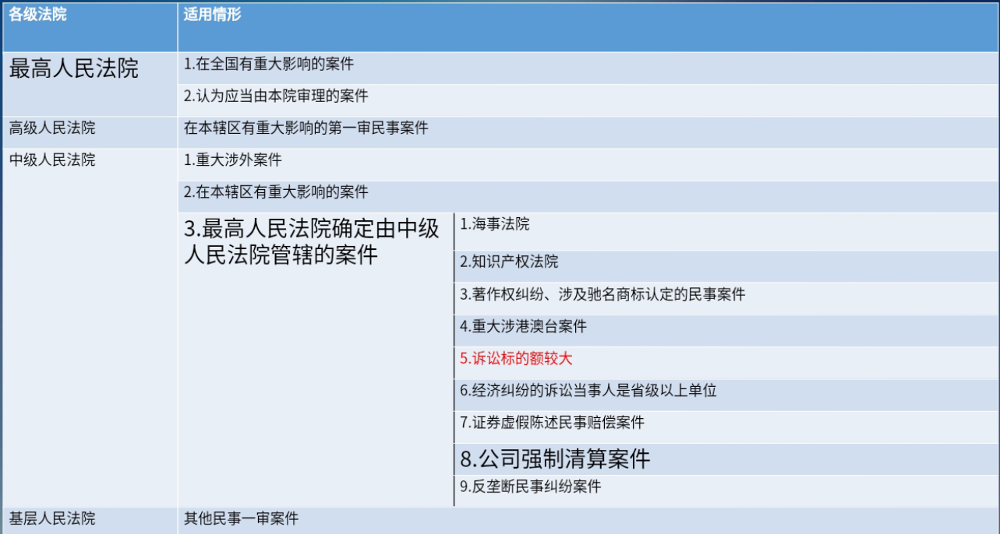
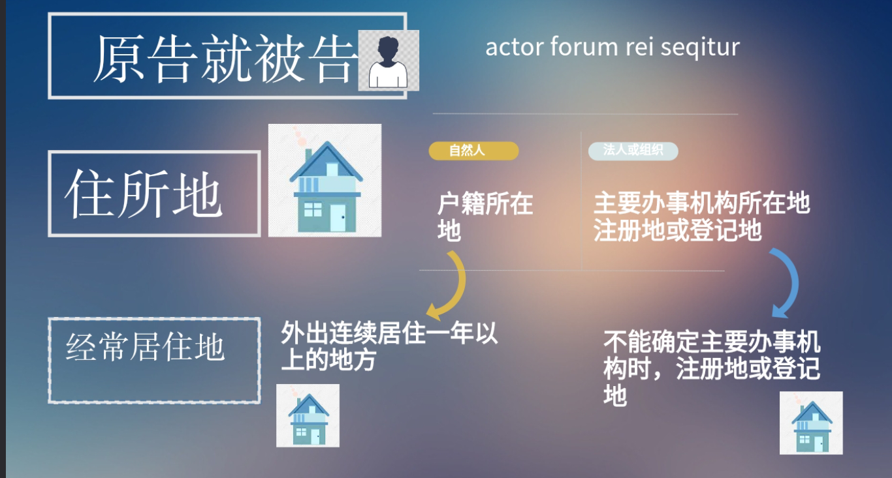

# 法院
# 一、审级制度
“四级两审终审制”

- 民事诉讼的审级原则:“两审终审制”
>第一百七十一条 当事人不服地方人民法院第一审判决的，有权在判决书送达之日起十五日内向上一级人民法院提起上诉。\
当事人不服地方人民法院第一审裁定的，有权在裁定书送达之日起十日内向上一级人民法院提起上诉
- 特殊审级例外:“一审终审制”
  1. 最高人民法院一审终审的民事案件
  2. 小额诉讼案件
  3. 特别程序审理的案件
### 小额诉讼案件
>第一百六十五条 基层人民法院和它派出的法庭审理事实清楚、权利义务关系明确、争议不大的简单金钱给付民事案件,标的额为各省、自治区、直辖市上年度就业人员年平均工资百分之五十以下的,适用小额诉讼的程序审理，实行一审终审。\
基层人民法院和它派出的法庭审理前款规定的民事案件,标的额超过各省、自治区、直辖市上年度就业人员年平均工资百分之五十但在二倍以下的，当事人双方也可以约定适用小额诉讼的程序。
1. 事实清楚、权利义务关系明确、争议不大
2. 金钱给付民事案件
3. 标的额较小;或者约定
##### 例外
1. 人身关系、财产确权案件
2. 涉外案件
3. 需要评估、鉴定或者对诉前评估、鉴定结果有异议的案件
4. 一方当事人下落不明的案件
5. 当事人提出反诉的案件
6. 其他不宜适用小额诉讼的程序审理的案件
# 二、审判组织
## (一) 合议制
1. 审判员：审判长、其他审判员
2. 陪审员：参与民事审理的公民
### 审判长的产生
1. 院庭长参审时自己担任
2. 院庭长指定
### 分类
1. 一审合议庭
>第四十条第一款 人民法院审理第-一审民事案件，由审判员、陪审员共同组成合议庭或者由审判员组成合议庭。。合议庭的成员人数，必须是单数
2. 二审合议庭
>第四十一条第一款 人民法院审理第二审民事案件，由审判员组成合议庭，合议庭的成员人数，必须是单数。
3. 重审合议庭=一审合议庭
>第四十一条第三款 发回重审的案件，原审人民法院应当按照第一审程序另行组成合议庭
4. 再审合议庭
>四十一条第四款 原审是一审,按照一审组成合议庭;原审是二审或提审,二审合议庭

## (二) 独任制
### 一审独任制
>第四十条第二款 适用简易程序审理的民事案件，由审判员一人独任审理。基层人民法院审理的基本事实清楚、权利义务关系明确的第一审民事案件，可以由审判员一人适用普通程序独任审理
### 二审独任制
>第四十一条第二款(2022年1月1日起施行修正) 中级人民法院对第一审适用简易程序审结或者不服裁定提起上诉的第二审民事案件，事实清楚、权利义务关系明确的，经双方当事人同意可以由审判员一人独任审理。

### 扩张独任制范围修法的“补丁”
>第四十二条 人民法院审理下列民事案件，不得由审判员一人独任审理\
(一) 涉及国家利益、社会公共利益的案件\
(二) 涉及群体性纠纷，可能影响社会稳定的案件\
(三)人民群众广泛关注或者其他社会影响较大的案件\
(四)属于新类型或者疑难复杂的案件\
(五)法律规定应当组成合议庭审理的案件\
(六)其他不宜由审判员一人独任审理的案件
### 转换合议制裁定
#### 独任制转换合议庭
>第四十三条 人民法院在审理过程中，发现案件不宜由审判员一人独任审理的，应当裁定转由合议庭审理。
#### 当事人异议
当事人认为案件由审判员一人独任审理违反法律规定的，可以向人民法院提出异议。人民法院对当事人提出的异议应当审查，异议成立的，裁定转由合议庭审理，异议不成立的，裁定驳回。
## (三) 陪审制
>第四十条第三款 陪审员在执行陪审职务时，与审判员有同等的权利义务。

>《人民陪审员法》第十四条 人民陪审员和法官组成合议庭审判案件，由法官担任审判长,可以组成三人合议庭，也可以由法官三人与人民陪审员四人组成七人合议庭。
- 三人合议庭
- 七人合议庭(影响重大、公益民事诉讼)
## (四) 审判委员会
1. 院长
2. 副院长
3. 资深法官
#### 决定院长的回避
>第四十九条 院长担任审判长或者独任审判员时的回避，由审判委员会决定，审判人员的回避，，由院长决定;其他人员的回避，由审判长或者独任审判员决定。
#### 再审的讨论和决定
>第二百零五条 各级人民法院院长对本院已经发生法律效力的判决、裁定、调解书，发现确有错误，认为需要再审的，应当提交审判委员会讨论决定。
#### 疑难案件的讨论和决定
>《法阮组织法》男二十七条 讨论决定重大、疑难、复杂案件的法律适用
# 三、管辖
### 管辖的定义
上下级与同级法院之间关于受理一审民事案件的分工和权限
### 管辖权恒定规则
1. 行政区域变动
2. 当事人住所地、经常居住地变动
3. 增加诉讼请求
4. 撤回本诉

法院之管辖,以起诉时为准:起诉时法院有审判权者,不因诉讼系属后事实及法律状态变更而受影响
## (一) 级别管辖

## (二) 地域管辖
### 一般地域管辖
#### 原告就被告

#### 例外：被告就原告
1. 被告不在中华人民共和国领域内+身份关系诉讼
2. 被告下落不明或宣告失踪+身份关系诉讼
3. 被告被采取强制性教育措施
4. 被告被监禁
### 特殊地域管辖
#### A 
>第二十四条:因合同纠纷提起的诉讼，由被告住所地或者合同履行地人民法院管辖。
1. 最优先:约定的履行地
   1. 当事人有明确约定的，以约定的履行地为合同履行地
2. 接受货币一方所在地
   1. 没有约定，争议的标的为给付货币的
3. 不动产所在地
   1. 没有约定，争议的标的为交付不动产的
4. 履行一方所在地
   1. 没有约定，争议的是其他标的
5. 交易行为地
   1. 即时结清的合同
6. 租赁物使用地
   1. 融资租赁合同
7. 信息网络方式订立的合同
   1. 买受人住所地
      1. 以信息网络交付标的物的
   2. 收货地
      1. 以其他方式交付标的物的
#### B
>第二十五条 因保险合同纠纷提起的诉讼，由被告住所地或者保险标的物所在地人民法院管辖
- 两种特殊情况
  1. 运输工具登记注册地、运输目的地、保险事故发生地
     1. 标的物是运输工具或运输中的货物
  2. 被保险人住所地
     1. 人身保险合同
#### C
>第二十八条 因铁路、公路、水上、航空运输和联合运输合同纠纷提起的诉讼，由运输始发地、目的地或者被告住所地人民法院管辖。
#### D
>第二十六条 因票据纠纷提起的诉讼，由票据支付地或者被告住所地人民法院管辖。
载明的付款地→付款人的住所地或主营业场所
#### E
>第二十九条 因侵权行为提起的诉讼，由侵权行为地或者被告住所地人民法院管辖。
- 行为实施地→侵害结果发生地
- 产品制造地、销售地、服务提供地、侵权行为地
- 被诉信息设备所在地
- 侵犯专利的产品制造、使用、许诺销售、销售、进口等行为的实施地
- 侵犯商标的储藏地、查封扣押地
#### F
>第三十条 因铁路、公路、水上和航空事故请求损害赔偿提起的诉讼，由事故发生地或者车辆、船舶最先到达地、航空器最先降落地或者被告住所地人民法院管辖
#### G
>第三十一条 因船舶碰撞或者其他海事损害事故请求损害赔偿提起的诉讼，由碰撞发生地、碰撞船舶最先到达地、加害船舶被扣留地或者被告住所地人民法院管辖

>第三十二条因海难救助费用提起的诉讼，由救助地或者被救助船舶最先到达地人、民法院管辖。

>第三十三条因共同海损提起的诉讼，由船舶最先到达地、共同海损理算地或者航程终止地的人民法院管辖。

>最高人民法院《关于审理船舶油污损害赔偿纠纷案件若干问题的规定》第二条 当事人就油轮装载持久性油类造成的油污损害提起诉讼、申请设立油污损害赔偿责任限制基金，由船舶油污事故发生地海事法院管辖。
#### H
>第二十七条 因公司设立、解散等纠纷提起的诉讼确认股东资格、.分配利润、由公司住所地人民法院管辖。
## (三) 专属管辖
法定强制性规定，不能协议变更
>第三十四条，下列案件，由本条规定的人民法院专属管辖:\
(一)因不动产纠纷提起的诉讼，由不动产所在地人民法院管辖\
(二)因港口作业中发生纠纷提起的诉讼，由港口所在地人民法院管辖\
(三)因继承遗产纠纷提起的诉讼由被继承人死亡时住所地或者主要遗产所在地人民法院管辖。
## (四)协议管辖
(明示的协议管辖)
>第三十五条 合同或者其他财产权益纠纷的当事人可以书面协议选择被告住所地、合同履行地、合同签订地、原告住所地、标的物所在地等与争议有实际联系的地点的人民法院管辖，但不得违反本法对级别管辖和专属管辖的规定。
1. 程序：仅限一审
2. 纠纷内容：合同或其他财产权益纠纷
3. 法院范围：与争议有实际联系的地点
4. 形式：可以书面约定
5. 数量：可以多个
## (五) 裁定管辖
移送管辖
>第三十七条 人民法院发现受理的案件不属于本院管辖的，应当移送有管辖权的人民法院，受移送的人民法院应当受理。

指定管辖
>第三十七条 人民法院发现受理的案件不属于本院管辖的,应当移送有管辖权的人民法院,受移送的人民法院应当受理。受移送的人民法院认为受移送的案件依照规定不属于本院管辖的，应当报请上级人民法院指定管辖，不得再自行移送。

>第三十八条 有管辖权的人民法院由于特殊原因,不能行使管辖权的,由上级人民法院指定管辖。\
人民法院之间因管辖权发生争议,由争议双方协商解决:协商解决不了的，报请它们的共同上级人民法院指定管辖。