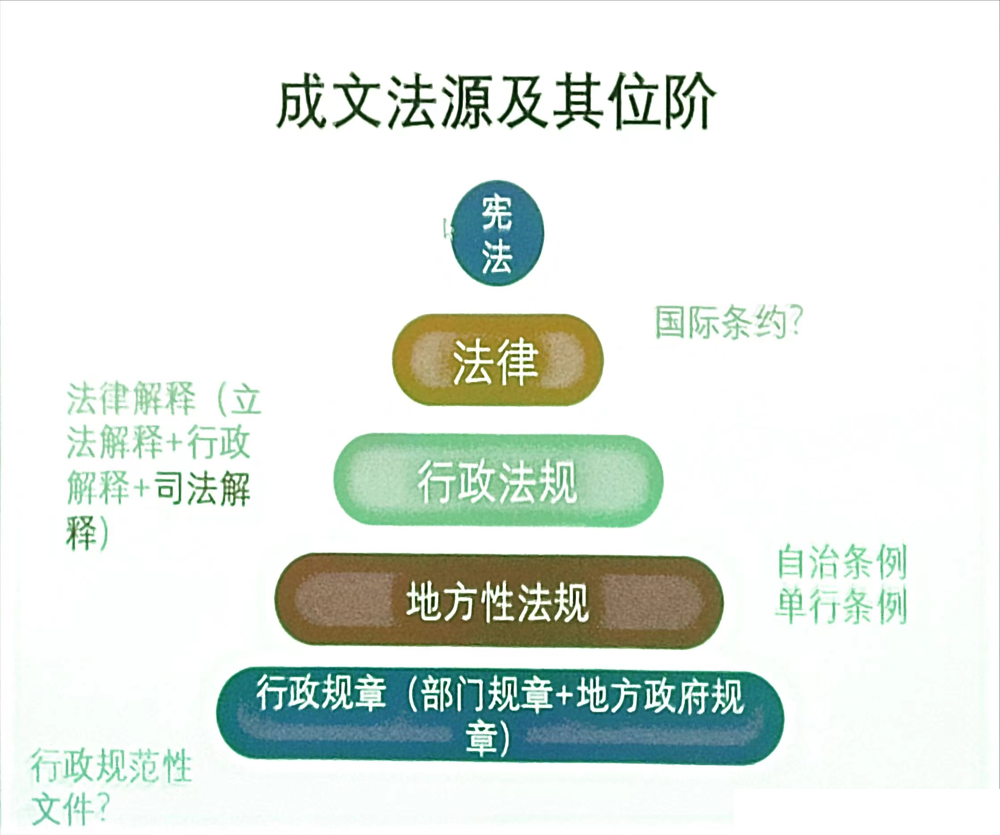

# 特色

- 三大核心法学之一
- 没有以“行政法”为名的法律
- 个别法的解释问题
- 行政法包括实体法和诉讼法
- 行政法理论、通则的法律与个别法、事案例之间的架桥

# 历史

- <清国行政法>
  - 此书并不认为清朝有行政法，只是用行政法的思路去分析而已
  - 法史学界对古代行政法多数认同
  - 行政法学界对古代行政法多有异议否定古代存在行政法是主流
  - 行政法是近代国家的产物，以权力分立/分工为前提，以保护权利为目的
  - 古代行政法=官僚制度≠行政法

### 舶来与孕育

- 戊戌变法(1898)前后康、梁从日本舶来
- 梁启超《论中国成文法编制之沿革得失》(1904):规定行政机关及其活动之规律者，是为行政法
- 夏同龢在清水澄讲义基础上编辑《行政法》(1905)

#### 重启与新生(1982)

# 定义

### 代表定义(8种)

1. 钟赓言:行政法者,规律国家行政权之组织及其作用之法则也。
2. 范 扬:行政法者，乃规律行政权之组织及其作用之法也。
3. 龚祥瑞:行政法是关于行政的法律…是有关行政机关的组织和职能、权限和职责的规范的总和…从作用上来看，行政法也就是"控权法"
4. 罗豪才:从调整对象角度界定，行政法可以表述为调整行政关系和权法”。基于行政关系而产生的监督行政的关系的法律规范体系…综观行政法的运作全局，它经历了(管理中的)非平衡--(监督中的)非平衡--平衡的辩证发展过程……这种行政法观念被称为平衡论应松年(教材):行政法是有关行政以及与行政有关的…主体及职权、行为及程序、违法及责任和救济关系等的法律规范的总称.
5. 姜明安:行政法是指调整行政关系的、规范和控制行政权的法律规范系统。
6. 马怀德:行政法是规范行政权及其运作程序的法律，即关于行政权力的授予、行使以及对行政权力进行监督和对其行使后果予以补救的法律规范的总称

### 关于(公共)行政的法

1. 国家行政(主)+社会行政(辅)
2. 形式行政(主)+实质行政(补)
3. 规制行政(主)+给付行政(新)
4. 常态行政(主)+应急行政(另)

### 规范行政权的(国内公)法

- 授予(组织)→行使(行为)→监控(诉讼)→补救(赔偿)

### 调整行政关系的法

- 行政关系与行政法律关系
    1. 行政管理关系
    2. 内部行政关系
    3. 行政法治监督关系
    4. 行政救济关系

## 行政法基础理论

- 控权论是司法界和法学界的主流
~~~
连云港佑源医药设备制造有限公司与连云港市连云区市场监督管理局质量监督检疫行政非诉行政裁定书(2018)江苏省连云港市中级人民法院认为，行政法是“控权法”，’，其目的是制约公权、保障私权
~~~

- 平衡论是立法者和制度设计者的视角
>《行政诉讼法》1989第一条为保证人民法院正确、及时审理行政案件保护公民、法人和其他组织的合法权益，维护和监督行政机关依法行使行政职权，根据宪法制定本法。

>《行政诉讼法》2017第一条，为保证人民法院公正、及时审理行政案件解决行政争议，保护公民、法人和其他组织的合法权益，监督行政机关依法行使职权，根据宪法，制定本法。
# 法源
### 成文法源及其位阶

##### 重要司法解释
最高人民法院印发《关于修改(最高人民法院关于司法解释工作的规定)的决定》的通知(法发〔2021〕20号)，司法解释的形式分为“批复”、“决定”、“解释”、“规定”和“规则”五种。
##### 主要行政法律
1. 行政许可法
2. 行政处罚法
3. 行政强制法
4. 行政复议法
5. 行政诉讼法
6. 国家赔偿法
7. 公务员法
##### 重要行政法规
 1. 行政法规制定程序条例、规章制定程序条例
 2. 政府信息公开条例
 3. 国有土地上房屋征收与补偿条例
 4. 重大行政决策程序暂行条例
### 成文法源适用与解释
1. 下位法符合上位法
2. 特别规定优于一般法
3. 地方性法规与部门规章冲突的选择适用
4. 规章冲突的选择适用
5. 新旧法律规范的适用
   1. 实体上从旧，程序上从新
   2. 实体上对相对人权利保护更有利的，也可以从新
6. 类案检索
- 一般按照其通常语义(客观性更强)进行解释;有专业上的特殊涵义的该涵义优先;语义不清楚或者有歧义的，可以根据上下文和立法宗旨、目的和原则等确定其涵义。
### 成文法源的特点
1. 范围广泛
2. 规范分散
3. 变动不居
4. 行政法能否制定统一法典？