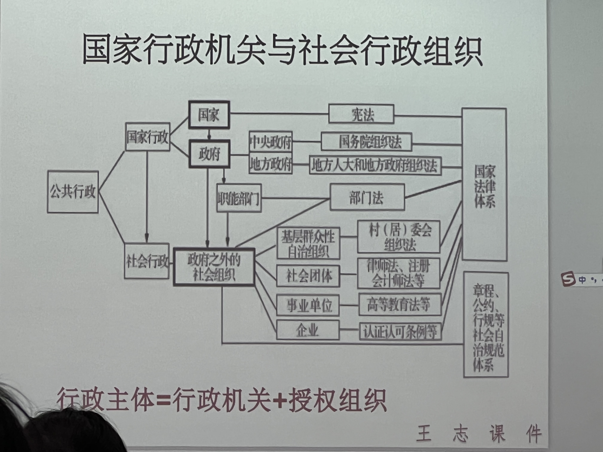

# 第三讲 行政组织
### 行政区划与行政层级

### 国家行政机关与社会行政组织

### 行政授权与行政委托
1. 行政授权:依具体法律、法规、规率授权面行使特定行政职的国家行政机关组织。应具备以下条件
   1. 相应组织应与所授权行使的行政职能无利害关系:
   2. 相成组织应具有了解和掌握与所行使行政职能有关的法、法规、规章和有关技术知识的工作人员
   3. 相应组织应具各所授行政职能行使所需要的基本设备和条件
   4. 对于某些特别行政，被授权组织还应具备某些特别的条件，如保密、安个、技术、经验以及工作人员的特殊素质要求等。
根据我国法律、法规、规章授权的情况，投权组织的范国人致包括基层群众性自治组织、行业组织、工青妇等社会团体、事业与企业组织、行政机关的内设机构和派出机构。

2. 行政委托:行政机关委托行政机关系统以外的受法律认可并符合法定条件的礼会组织行伙某种行政职德、办理某神行政本务。行政委托不同于法，法烦、规章骎权，受委托组织是以委托行政机关的名义行使职权，并由季托行政机关对受委托组织的行为承担法律责任，受委托组织不是行政主，行政主体是委托行政机关。

|比较项|行政授权|行政委托|
|---|---|---|
|结果|被授权者获得行政主体资格|被委托者没有行政主体资格(以委任机美名义)|
|作出主体|法律、法规或规章的授予|行政主体
|对象|无行政权能的机构、组织|机关、机构、组织、个体|
### 派出机关与派出机构
1. 派出机关:省、自治区的人民政府在必要的时候，经国务院批准，可以设立若干派出机关(行政公署10)。县、自治县的人民政府在必要的时候，经省、自治区、直辖市的人民政府批准，可以设立若干区公所2，作为它的派出机关。市辖区、不设区的市的人民政府，经上一级人民政府批准，可以设立若干街道办事处，作为它的派出机关。
2. 派出机构:一是各级政府驻外办事机构，如驻京办、驻外办等:二是政府在特殊经济区域或特殊地区的派出机构，如各类开发区(含高新技术产业园区、经济开发区、出口加工区)及风景名胜区管理机构等;三是政府职能部门设立的派出机构，如公安分局与派出所、国土分局与国土所、市场监管分局与市场监管所、地税分局与地税所、司法所等。政府派出机构主要根据组织法以外的行政性规章或地方性法规设立，不是独立的行政主体，除非有法律法规的明确授权，否则不以自己的名义行使行政权力。

|名称|设立者|行政职权|
|---|---|---|
|派出所|公安局|警告、500元以下罚款|
|市监所|市监局|对个体工商户违法行为的处罚；处罚种类不包括吊销营业执照|
|税务所|税务局|2000元以下的罚款|
# 中央国家行政机关
## 党和国家主要机构
1. 中国共产党中央领导机构
2. 全国人民代表大会常务委员会、中华人民共和国主席、**国务院**、中央军事委员会、国家监察委员会、最高人民法院、最高人民检察院
3. 中国人民政治协商会议全国委员会、民主党派
## 国务院
中华人民共共和国的国务院，即中央人民政府，是最高国家权力机关的执行机关，是最高国家行政机关、由总理、副总理、国务委员、各部部长、各委员会主任、审计长、秘书长照成。国务院实行总理负责制。

国务院秘书长在总理的领导下、负费处理国务院的日常工作。国务院设立办公厅。由秘书长领导
### 组成部门
|组成部门|组成部门|组成部门|组成部门|
|:---:|:---:|:---:|:---:|
|中华人民共和国外交部|中华人民共和国国家安全部|中华人民共和国司法部|中华人民共和国人力资源和社会保障部|
|中华人民共和国国防部|中华人民共和国生态环境部|中华人民共和国交通运输部|中国人民银行|
|中华人民共和国国家发展和改革委员会|中华人民共和国教育部|中华人民共和国农业农村部|中华人民共和国工业和信息化部|
|中华人民共和国科学技术部|中华人民共和国退役军人事务部|中华人民共和国财政部|中华人民共和国自然资源部|
|中华人民共和国住房和城乡建设部|中华人民共和国水利部|中华人民共和国商务部|中华人民共和国国家卫生健康委员会|
|中华人民共和国国家民族事务委员会|中华人民共和国文化和旅游部|中华人民共和国公安部|中华人民共和国民政部|
|中华人民共和国应急管理部|中华人民共和国审计署|---|---|

- 教育部对外保留国家语言文字工作委员会牌子。工业和信息化部对外保留国家航天局、国家原子能机构牌子。人力资源和社会保障部加挂国家外国专家局牌子。自然资源部对外保留国家海洋局牌子。生态环境部对外保留国家核安全局牌子。农业农村部加挂国家乡村振兴局牌子。
### 直属机构与办事机构
#### 国务院直属特设机构
国务院国有资产监督管理委员会
#### 国务院直属机构
|机构名称|机构名称|机构名称|机构名称|
|:---:|:---:|:---:|:---:|
|中华人民共和国海关总暑|国家税务总局|国家市场监督管理总局|国家体育总局|
|国家金融监督管理总局|中国证券监督管理委员会|国家统计局|国家国际发展合作暑|
|国家广播电视总局|国家信访局|国家医疗保障局|国家机关事务管理局|
|国家知识产权局|国务院参事室|---|---|
#### 国务院办事机构
- 国务院研究室

国务院侨务办公室在中央统战部加挂牌子，由中央统战部承担相关职费。国务院港演事务办公室在中共中央港澳工作办公室加挂牌子，由中共中央港澳工作办公室承担相关职责。国务院台湾事务办公室与中共中央台湾工作办公室、国家互联网信息办公室与中央网络安全和信息化委员会办公室，一个机构两块牌子，列入中共中央直属机构序列。国务院新闻办公室在中央宣传部加挂牌子，由中央宣传部承担相关职责。
### 直属事业单位与国家局
#### 国务院直属事业单位
|机构名称|机构名称|机构名称|
|:---:|:---:|:---:|
|新华通讯社|中国社会科学院|中国工程院|
|中央广播电视总台|中国气象局|中国科学院|
|国务院发展研究中心|---|---|

国家行政学院与中央党校，一个机构两块牌子，作为党中央直属事业单位。
#### 国务院部委管理的国家局
|机构名称|机构名称|
|:---:|:---:|
|国家粮食和物资储备局(由国家发展和政革委员会管理)|国家数据局(由国家发展和改革委员会管理)|
|国家烟草专卖局(由工业和信息化部管理)|国家林业和草原局(由自然资源部管理)|
|中国民用航空局(由交通运输部管理)|国家文物局(由文化和旅游部管理)|
|国家疾病预防控制局(由国家卫生健康委员会管理)|国家能源局(由国家发展和改革委员会管理)|
|国家消防救援局(由应急管理部管理)|国家国防科技工业局(由工业和信息化部管理)|
|国家药品监督管理局(由国家市场监督管理总局管理)|国家移民管理局(由公安部管理)|
|国家铁路局(由交通运输部管理)|国家邮政局(由交通运输部管理)|
|国家中医药管理局(由国家卫生健康委员会管理)|国家矿山安全监察局(由应急管理部管理)|
|国家外汇管理局(由中国人民银行管理)|---|

国家移民管理局加挂中华人民共和国出入境管理局牌子。国家林业和草原局加挂国家公园管理局牌子。国家公务员局在中央组织部加挂牌子，由中央组织部承担相关职责。国家档案局与中央档案馆、国家保密局与中央保医委员会办公室、国家密码管理局与中央密码工作领导小组办公室，一个机构两块牌子，列入中共中央直属机关的下属机构序列。
#### 议事协调机构
- 国家国防动员委员会，具体工作由国家发展和改革委员会、总参谋部、总政治部、总后部承担。
- 国务院中央军委专门委员会，具体工作由工业和信息化部承担。
- 国家边海防委员会，具体工作由总参谋部承担。
- 国务院中央军委空中交通管制委员会，具体工作由总参谋部承担。
- 全国爱国卫生运动委员会，具体工作由卫生部承担。
- 全国绿化委员会，具体工作由国家林业局承担。
- 国务院学位委员会，具体工作由教育部承担。
- 国家防汛抗早总指挥部，具体工作由水利部承担。
- 国务院妇女儿童工作委员会，具体工作由中华全国妇女联合会承担。
- 全国拥军优属拥政爱民工作领导小组，具体工作由民政部、总政治部承-担。
- 国务院残疾人工作委员会，具体工作由中国残疾人联合会承担。
- 国务院扶贫开发领导小组，单设办事机构。
- 国务院关税税则委员会，具体工作由财政部承担。
- 国家减灾委员会，具体工作由民政部承担。
- 国家科技教育领导小组，具体工作由国务院办公厅承担。
- 国务院军队转业干部安置工作小组，具体工作由人力资源和社会保障部承担
- 国家禁毒委员会，具体工作由公安部承担。
- 全国老龄工作委员会，办公室设在民政部，与中国老龄协会合署办公。
- 国务院西部地区开发领导小组，撤销其单设的办事机构，具体工作由国家发展和改革委员会承担。
- 国务院振兴东北地区等老工业基地领导小组，撤销其单设的办事机构，具体工作由国家发展和改革委员会承担。
- 国务院抗震救灾指挥部，具体工作由中国地震局承担。
- 国家信息化领导小组，具体工作由工业和信息化部承担。
- 国家应对气候变化及节能减排工作领导小组(对外视工作需要可称国家应对气候变化领导小组或国务院节能减排工作领导小组)，具体工作由国家发展和改革委员会承担。
- 国家能源委员会，具体工作由国家能源局承担。
- 国务院安全生产委员会，具体工作由国家安全生产监督管理总局承担。
- 国务院防治艾滋病工作委员会，具体工作由卫生部承担。
- 国家森林防火指挥部，具体工作由国家林业局承担。
- 国务院三峡工程建设委员会，单设办事机构，工作任务完成后撤销。
- 国务院南水北调工程建设委员会，单设办事机构，工作任务完成后撤销。
- 全国“扫黄打非”办公室
  - 全国“扫黄打非”工作小组隶属于中央宣传思想工作领导小组，由中央宣传部、中央统战部中央政法委、中央网信办、中央台湾工作办公室、国务院办公厅、最高人民法院、最高人民检察院、教育部、工业和信息化部、公安部、国家安全部、民政部、财政部、住房和城乡建设部、交通运输部、文化和旅游部、海关总署国家市场监管总局、国家广播电视总局、国家版权局、中国民用航空局、国家邮政局、中共北京市委、中央军委政治工作部、中国铁路总公司等26个部门组成。全国“扫黄打非”工作小组办公室设在中央宣传部。
#### 群众团体机关
|机构名称|机构名称|机构名称|
|:---:|:---:|:---:|
|中华全国工商业联合会机关|中华全国妇女联合会机关|黄埔军校同学会机关|
|中华全国总工会机关|中国计划生育协会机关|中国人民外交学会机关中国宋庆龄基金会机关|
|中国共产主义青年团中央委员会机关|中华职业教育社机关|中国残疾人联合会机关中国红十字会总会机关|
|中国文学艺术界联合会机关|中国思想政治工作研究会机关|中国国际贸易促进委员会(中国国际商会)机关|
|中国作家协会机关|欧美同学会(中国留学人员联谊会)机关|中华全国新闻工作者协会机关中华全国台湾同胞联谊会机关|
|中国科学技术协会机关|中国人民对外友好协会机关|中国法学会机关|
|中华全国归国华侨联合会机关|---|---|
### 国务院组织基本原则
1. 法治政府
2. 创新政府
3. 廉洁政府
4. 服务型政府
### 会议制度
1. 国务院全体会议
2. 国务院常务会议
3. 总理办公会议
4. 国务院专题会议
### 国务院与全国人大
- 国务院发布的决定、命令和行政法规，向全国人民代表大会或者全国人民代表大会常务委员会提出的议案，任免人员，由总理签署。
- 国务院各部、各委员会的设立、撤销或者合并，经总理提出，由全国人民代表大会决定;在全国人民代表大会闭会期间，由全国人民代表大会常务委员会决定。国务院各部、各委员会确定或者调整后，由全国人民代表大会或者全国人民代表大会常务委员会公布。
### 部委内部构成
- 国务院组成部门设部长(主任、行长、审计长)一人，副部长(副主任、副行长、副审计长)二至四人。委员会可以设委员五至十人。
- 国务院组成部门实行部长(主任、行长、审计长)负责制。部长(主任、行长、审计长)领导本部门的工作，召集和主持部务(委务、行务、署务)会议，讨论决定本部门工作的重大问题:签署上报国务院的重要请示、报告和发布的命令、指示。副部长(副主任、副行长、副审计长)协助部长(主任、行长、审计长)工作。
- 国务院可以根据工作需要和优化协同高效精简的原则，按照规定程序设立若干直属机构主管各项专门业务，设立若干办事机构协助总理办理专门事项。每个机构设负责人二至五人
### 决策、监督与协调
- 国务院坚持科学决策、民主决策、依法决策，健全行政决策制度体系，规范重大行政决策程序，加强行政决策执行和评估，提高决策质量和效率
- 国务院健全行政监督制度，加强**行政复议**、法规和规章备案审查、行政执法监督、政府督查等工作，强化对行政权力运行的制约和监督。
- 国务院组成部门、直属机构、办事机构应当各司其职、各负其责、加强协调、密切配合，确保党中央、国务院各项工作部署贯彻落实。
# 地方行政组织
国务院组成部门、直属机构、办事机构应当各司其职、各负其责、加强协调、密切配合，确保党中央、国务院各项工作部署贯彻落实。
## 关系
- 地方各级人民政府对本级人民代表大会和上一级国家行政机关负责并报告工作县级以上的地方各级人民政府在本级人民代表大会闭会期间，对本级人民代表大会常务委员会负责并报告工作
- 全国地方各级人民政府都是国务院统一领导下的国家行政机关，都服从国务院
- 地方各级人民政府实行重大事项请示报告制度
## 县级以上地方各级人民政府的职权
1. 执行本级人民代表大会及其常务委员会的决议，以及上级国家行政机关的决定和命令，规定行政措施，发布决定和命令;
2. 领导所属各工作部门和下级人民政府的工作:
3. 改变或者撤销所属各工作部门的不适当的命令、指示和下级人民政府的不适当的决定、命令;
4. 依照法律的规定任免、培训、考核和奖惩国家行政机关工作人员;
5. 编制和执行国民经济和社会发展规划纲要、计划和预算，管理本行政区域内的经济、教育、科学、文化、卫生、体育、城乡建设等事业和生态环境保护、自然资源、财政、民政、社会保障、公安、民族事务、司法行政、人口与计划生育等行政工作:
6. 保护社会主义的全民所有的财产和劳动群众集体所有的财产，保护公民私人所有的合法财产，维护社会秩序，保障公民的人身权利、民主权利和其他权利;
7. 履行国有资产管理职责:
8. 保护各种经济组织的合法权益;
9. 铸牢中华民族共同体意识，促进各民族广泛交往交流交融，保障少数民族的合法权利和利益，保障少数民族保持或者改革自己的风俗习惯的自由，帮助本行政区域内的民族自治地方依照宪法和法律实行区域自治，帮助各少数民族发展政治、经济和文化的建设事业:
10. 保障宪法和法律赋予妇女的男女平等、同工同酬和婚姻自由等各项权利;
11. 办理上级国家行政机关交办的其他事项。
## 乡、民族乡、镇人民政府的职权
1. 执行本级人民代表大会的决议和上级国家行政机关的决定和命
令，发布决定和命令。
2. 执行本行政区域内的经济和社会发展计划、预算，管理本行政区域内的经济、教育、科学、文化、卫生、体育等事业和生态环境保护、财政、民政、社会保障、公安、司法行政、人口与计划生育等行政工作
3. 保护社会主义的全民所有的财产和劳动群众集体所有的财产保护公民私人所有的合法财产，维护社会秩序，保障公民的人身权利、民主权利和其他权利
4. 保护各种经济组织的合法权益
5. 铸牢中华民族共同体意识，促进各民族广泛交往交流交融，保障少数民族的合法权利和利益，保障少数民族保持或者改革自己的风俗习惯的自由
6. 保障宪法和法律赋予妇女的男女平等、同工同酬和婚姻自由等各项权利
7. 办理上级人民政府交办的其他事项
## 跨区域、跨部门
- 县级以上的地方各级人民政府根据国家区域发展战略，结合地方实际需要，可以共同建立跨行政区划的区域协同发展工作机制，加强区域合作。上级人民政府应当对下级人民政府的区域合作工作进行指导、协调和监督。
- 县级以上的地方各级人民政府根据应对重大突发事件的需要，可以建立跨部门指挥协调机制。
## 业务指导或领导
- 省、自治区、直辖市的人民政府的各工作部门受人民政府统一领导，并且依照法律或者行政法规的规定受国务院主管部门的业务指导或者领导
- 自治州、县、自治县、市、市辖区的人民政府的各工作部门受人民政府统一领导，并且依照法律或者行政法规的规定受上级人民政府主管部门的业务指导或者领导
## 街道、乡镇
- **街道办事处**在本辖区内办理派出它的人民政府交办的公共服务、公共管理、公共安全等工作依法履行综合管理、统筹协调、应急处置和行政执法等职责，反映居民的意见和要求
- 乡、民族乡、镇的人民政府和市辖区、不设区的市的人民政府或者街道办事处对基层群众性自治组织的工作给予指导、支持和帮助。基层群众性自治组织协助乡、民族乡、镇的人民政府和市辖区、不设区的市的人民政府或者街道办事处开展工作
- 乡、民族乡、镇的人民政府和街道办事处可以根据实际情况建立居民列席有关会议的制度
# 内部行政法崛起
## 内部行政法