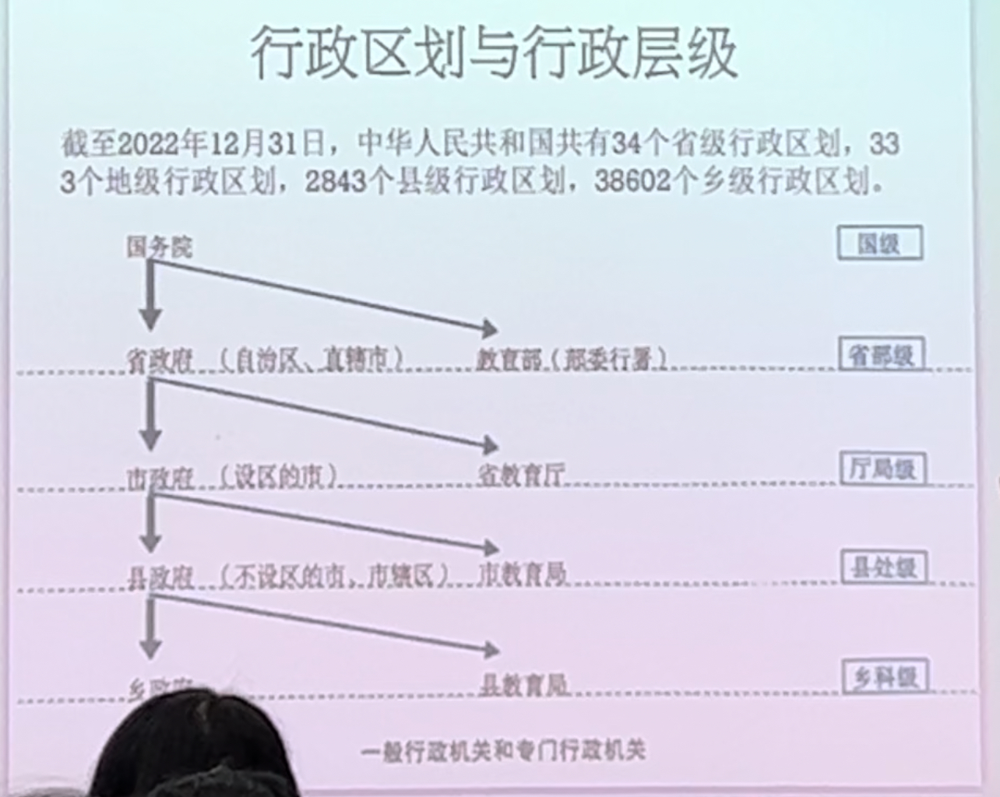

# 第三讲 行政组织
### 行政区划与行政层级

### 国家行政机关与社会行政组织

### 行政授权与行政委托
1. 行政授权:依具体法律、法规、规率授权面行使特定行政职的国家行政机关组织。应具备以下条件
   1. 相应组织应与所授权行使的行政职能无利害关系:
   2. 相成组织应具有了解和掌握与所行使行政职能有关的法、法规、规章和有关技术知识的工作人员
   3. 相应组织应具各所授行政职能行使所需要的基本设备和条件
   4. 对于某些特别行政，被授权组织还应具备某些特别的条件，如保密、安个、技术、经验以及工作人员的特殊素质要求等。
根据我国法律、法规、规章授权的情况，投权组织的范国人致包括基层群众性自治组织、行业组织、工青妇等社会团体、事业与企业组织、行政机关的内设机构和派出机构。

2. 行政委托:行政机关委托行政机关系统以外的受法律认可并符合法定条件的礼会组织行伙某种行政职德、办理某神行政本务。行政委托不同于法，法烦、规章骎权，受委托组织是以委托行政机关的名义行使职权，并由季托行政机关对受委托组织的行为承担法律责任，受委托组织不是行政主，行政主体是委托行政机关。

|比较项|行政授权|行政委托|
|---|---|---|
|结果|被授权者获得行政主体资格|被委托者没有行政主体资格(以委任机美名义)|
|作出主体|法律、法规或规章的授予|行政主体
|对象|无行政权能的机构、组织|机关、机构、组织、个体|
### 派出机关与派出机构
1. 派出机关:省、自治区的人民政府在必要的时候，经国务院批准，可以设立若干派出机关(行政公署10)。县、自治县的人民政府在必要的时候，经省、自治区、直辖市的人民政府批准，可以设立若干区公所2，作为它的派出机关。市辖区、不设区的市的人民政府，经上一级人民政府批准，可以设立若干街道办事处，作为它的派出机关。
2. 派出机构:一是各级政府驻外办事机构，如驻京办、驻外办等:二是政府在特殊经济区域或特殊地区的派出机构，如各类开发区(含高新技术产业园区、经济开发区、出口加工区)及风景名胜区管理机构等;三是政府职能部门设立的派出机构，如公安分局与派出所、国土分局与国土所、市场监管分局与市场监管所、地税分局与地税所、司法所等。政府派出机构主要根据组织法以外的行政性规章或地方性法规设立，不是独立的行政主体，除非有法律法规的明确授权，否则不以自己的名义行使行政权力。

|名称|设立者|行政职权|
|---|---|---|
|派出所|公安局|警告、500元以下罚款|
|市监所|市监局|对个体工商户违法行为的处罚；处罚种类不包括吊销营业执照|
|税务所|税务局|2000元以下的罚款|
# 中央国家行政机关
## 党和国家主要机构
1. 中国共产党中央领导机构
2. 全国人民代表大会常务委员会、中华人民共和国主席、**国务院**、中央军事委员会、国家监察委员会、最高人民法院、最高人民检察院
3. 中国人民政治协商会议全国委员会、民主党派
## 国务院
中华人民共共和国的国务院，即中央人民政府，是最高国家权力机关的执行机关，是最高国家行政机关、由总理、副总理、国务委员、各部部长、各委员会主任、审计长、秘书长照成。国务院实行总理负责制。

国务院秘书长在总理的领导下、负费处理国务院的日常工作。国务院设立办公厅。由秘书长领导
### 组成部门
|组成部门|组成部门|组成部门|组成部门|
|:---:|:---:|:---:|:---:|
|中华人民共和国外交部|中华人民共和国国家安全部|中华人民共和国司法部|中华人民共和国人力资源和社会保障部|
|中华人民共和国国防部|中华人民共和国生态环境部|中华人民共和国交通运输部|中国人民银行|
|中华人民共和国国家发展和改革委员会|中华人民共和国教育部|中华人民共和国农业农村部|中华人民共和国工业和信息化部|
|中华人民共和国科学技术部|中华人民共和国退役军人事务部|中华人民共和国财政部|中华人民共和国自然资源部|
|中华人民共和国住房和城乡建设部|中华人民共和国水利部|中华人民共和国商务部|中华人民共和国国家卫生健康委员会|
|中华人民共和国国家民族事务委员会|中华人民共和国文化和旅游部|中华人民共和国公安部|中华人民共和国民政部|
|中华人民共和国应急管理部|中华人民共和国审计署|---|---|

- 教育部对外保留国家语言文字工作委员会牌子。工业和信息化部对外保留国家航天局、国家原子能机构牌子。人力资源和社会保障部加挂国家外国专家局牌子。自然资源部对外保留国家海洋局牌子。生态环境部对外保留国家核安全局牌子。农业农村部加挂国家乡村振兴局牌子。
### 直属机构与办事机构
#### 国务院直属特设机构
国务院国有资产监督管理委员会
#### 国务院直属机构
|机构名称|机构名称|机构名称|机构名称|
|:---:|:---:|:---:|:---:|
|中华人民共和国海关总暑|国家税务总局|国家市场监督管理总局|国家体育总局|
|国家金融监督管理总局|中国证券监督管理委员会|国家统计局|国家国际发展合作暑|
|国家广播电视总局|国家信访局|国家医疗保障局|国家机关事务管理局|
|国家知识产权局|国务院参事室|---|---|
#### 国务院办事机构
- 国务院研究室

国务院侨务办公室在中央统战部加挂牌子，由中央统战部承担相关职费。国务院港演事务办公室在中共中央港澳工作办公室加挂牌子，由中共中央港澳工作办公室承担相关职责。国务院台湾事务办公室与中共中央台湾工作办公室、国家互联网信息办公室与中央网络安全和信息化委员会办公室，一个机构两块牌子，列入中共中央直属机构序列。国务院新闻办公室在中央宣传部加挂牌子，由中央宣传部承担相关职责。‘