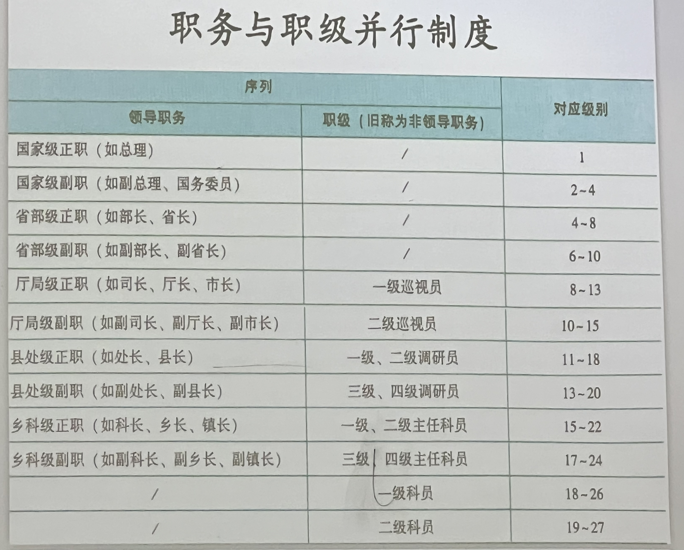
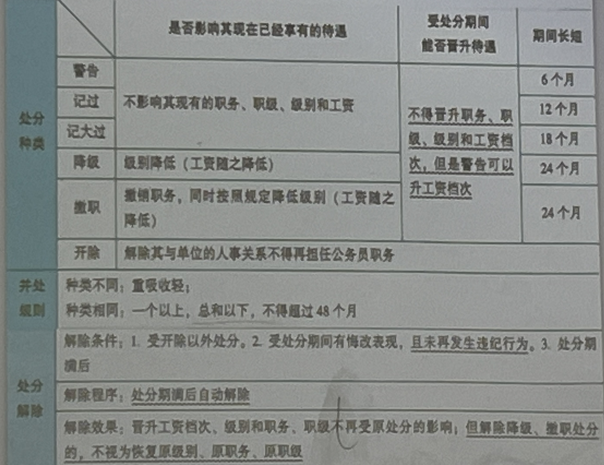
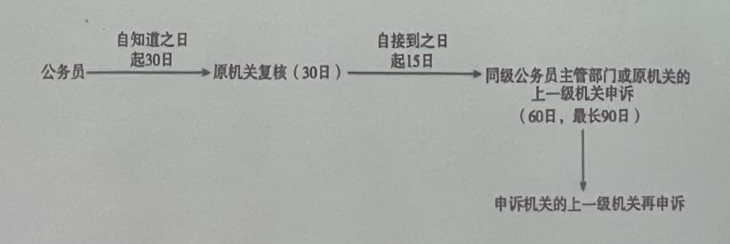

# 第四讲 行政官员
公务员法
~~~
2005年4月通过《公务员法》，2017年9月修正，2018年12月修订
~~~
# 一、范围
公务员，是指依法履行公职、纳入国家行政编制、由国家财政负担工资福利的工作人员
- 三个标准
  1. 职能标准
  2. 编制标准
  3. 经费标准
- 八类人员
  1. 中国共产党各级机关
  2. 各级人民代表大会及其常务委员会机关
  3. **各级行政机关**
  4. 中国人民政治协商会议各级委员会机关
  5. 各级监察机关
  6. 各级审判机关
  7. 各级检察机关
  8. 各民主党派和工商联的各级机关中除工勤人员以外的工作人员
## 基本原则
1. 党管干部原则
2. 公开、平等、竞争、择优原则
3. 监督约束与激励保障并重原则
4. 突出政治标准，注重工作实际
5. 分类管理
## 条件
1. 具有中华人民共和国国籍
2. 年满十八周岁
3. 拥护中华人民共和国宪法，拥护中国共产党领导和社会主义制度
4. 具有良好的政治素质和道德品行
5. 具有正常履行职贵的**身体条件**和心理素质
6. 具有符合职位要求的文化程度和工作能力
7. 法律规定的其他条件
### 其他条件
1. 应当具备省级以上公务员主管部门规定的拟任职位所要求的资格条件
国家对行政机关中初次从事行政处罚决定审核、行政复议行政裁决、法律顾问的公务员实行统一法律职业资格考试制度，由国务院司法行政部门商有关部门组织实施√ 
#### 下列人员不得录用为公务员:
1. 因犯罪受过刑事处罚的
2. 被开除中国共产党党籍的
3. 被开除公职的
4. 被依法列为失信联合惩戒对象的
5. 有法律规定不得录用为公务员的其他情形的。

担任法官必须从事法律工作满5年
# 二、身份
## 录用
1. 对象:担任一级主任科员以下及其他相当职级层次的公务员
2. 主管:中央机关及其直属机构公务员的录用，由中央公务员主管部门负责组织。地方各级机关公务员的录用，由省级公务员主管部门负青组织，必要时省级公务员主管部门可以授权设区的市级公务员主管部门组织
3. 招考公告:应当载明招考的职位、名额、报考资格条件报考需要提交的申请材料以及其他报考须知事项
4. 资格审查:报考者提交的中请材料应当真实、准确
5. 考试:笔试和面试等，分别设置
6. 资格复审、考察和体检:体检的项目和标准根据职位要求确定。具体办法由中央公务员主管部门会同国务院卫生健康行政部门规定
7. 公示期:不少于五个工作日
8. 新最用的公务员试用期为一年。试用期满合格的，予以任职，不合格的，取消录用
9. 宪法宣誓
## 辞职
辞去公职，应当向任免机关提出书面中请。任免机关应当自接到中请之日起三十日内于以审批，其中对领导成员辞去公职的中请，应当自接到中请之日起九十日内于以审批
- 公务员有下列情形之一的，不得辞去公职
  1. 未满国家规定的最低服务年限的
  2. 在涉及国家秘密等特殊职位任职或者离开上述职位不满国家规定的脱密期限的
  3. 重要公务尚未处理完毕，且须由本人继续处理的
  4. 正在接受审计、纪律审查、监察调查，或者涉犯罪，司法程序尚未终结的
  5. 法律、行政法规规定的其他不得辞去公职的情形。
- 比较——辞去领导职务的，领导成员因工作变动辞去现任职务的，因个人或者其他原因自愿提出辞去领导职务的，因工作严重失误、失职造成重大损失或者恶劣社会影响的，或者对重大事故负有领导责任的(引咎辞职)，因其他原因不再适合担任现任领导职务的或者应当引咎辞职本人不提出辞职的(责令辞职)
## 辞退
1. 在年度考核中，连续两年被确定为不称职的
2. 不胜任现职工作，又不接受其他安排的
3. 因所在机关调整、撤销、合并或者缩减编制员额需要调整工作，本人拒绝合理安排的
4. 不履行公务员义务，不遵守法律和公务员纪律，经教育仍无转变，不适合继续在机关工作，又不宜给于开除处分的
5. 旷工或者因公外出、请假期满无正当理由逾期不归连续超过十五天，或者一年内累计超过三十天的。
### 对有下列情形之一的公务员，不得辞退
1. 因公致残，被确认丧失或者部分丧失工作能力的
2. 惠病或者负伤，在规定的医疗期内的
3. 女性公务员在孕期、产假、哺乳期内的
4. 法律、行政法规规定的其他不得辞退的情形
辞退决定应当以书面形式通知被辞退的公务员，并应当告知辞退依据和理由。被辞退的公务员，可以领取辞退费或者根据国家有关规定事受失业保险

公务员辞职或者被辞退，离职前应当办理公务交接手续，要按照规定接受审计
## 退休
公务员达到国家规定的退休年龄或者完全丧失工作能力的，应当退休。

### 公务员符合下列条件之一的，本人自愿提出申请，经任免机关批准，可以提前退休
1. 工作年限满三十年的
2. 距国家规定的退休年龄不足五年，且工作年限满二十年的
3. 符合国家规定的可以提前退休的其他情形的

公务员退休后，享受国家规定的养老金和其他待遇国家为其生活和健康提供必要的服务和帮助，鼓励发挥个人专长，参与社会发展
## 职位聘任
1. 机关根据工作雷要，经省级以上公务员主管部门批准，可以对专业性较强的职位和辅助性职位实行聘任制。职位涉及国家秘密的，不实行聘任制。
2. 机关聘任公务员可以参限公务员考试录用的程序进行公开招聘，也可以从符合条件的人员中直接选聘。机关聘任公务员应当在规定的编限额和工资经费限额内进行
3. 机关聘任公务员。应当按照平等自愿、协商一致的原则，签订书面的聘任合同，确定机关与所聘公务员双方的权利、义务。聘任合同经双方协商一致可以变更或者解除。聘任合同的签订、变更或者解除，应当报同级公务员主管部门备案
4. 聘任合网应当具备合同期限，职位及其职责要求，工资、福利、保险待遇违约贵任等条款。聘任合同期限为一年至五年。聘任合同可以约定试用期试用期为一个月至十二个月
5. 聘任制公务员实行协议工资制。聘任制公务员与所在机关之向因行聘任合同发生争议的，可以自争议发生之日起六十日内申请仲裁。省级以上公务员主管部门根据雷要设立人事争议仲裁委员会，受理仲裁申请。人事争议仲裁委员会由公务员主管部门的代表、聘用机关的代表、聘任制公务员的代表以及法律专家组成。当事人对仲裁裁决不服的，可以自接到仲裁裁决书之日起十五日内向人民法院提起诉讼。仲裁裁决生效后，一方当事人不行的，另方当事人可以申请人民法院执行
# 三、管理
## 职务与职级并行制度

## 考核
1. 定期考核以平时考核、专项考核为基础
2. 非领导成员公务员的定期考核采取年度考核的方式
3. 定期考核的结果分为优秀、称职基本称职和不称职四个等次。定期考核的结果应当以书面形式通知公务员本人
## 任免
1. 公务员领导职务实行选任制、委任制和聘任制。公务员职级实行委任制和聘任制
2. 选任制公务员在选举结果生效时即任当选职务;任期届满不再连任或者任期内辞职、被罢免、被撤职的,其所任职务即终止
3. 委任制公务员试用期满考核合格，职务、职级发生变化，以及其他情形需要任免职务、职级的，应当按照管理权限和规定的程序任免
4. 公务员任职应当在规定的编制限额和职数内进行，并有相应的职位空缺
5. 公务员因工作需要在机关外兼职，应当经有关机关批准，并不得领取兼职报酬
## 升降
1. 政治素质、工作能力、文化程度和任职经历等方面的条件和资格。公务员领导职务应当逐级晋升。特别优秀的或者工作特殊需要的，可以按照规定破格或者越级晋升
2. 公务员晋升领导职务，按照下列程序办理
   1. 动议
   2. 民主推荐
   3. 确定考察对象，组织考察
   4. 按照管理权限讨论决定
   5. 履行任职手续
3. **厅局级正职以下领导**职务出现空缺且本机关没有合适人选的可以通过适当方式面向社会选拔任职人选
4. 提任县处级领导职务的，应当具有**五年**以上工龄和**两年以上基层**工作经历
5. 公务员的职务、职级实行能上能下。对不适宜或者不胜任现任职务、职级的，应当进行调整。公务员在年度考核中被确定为不称职的，按照规定程序降低一个职务或者职级层次任职。
## 奖励
1. 对工作表现突出，有显著成绩和贡献，或者有其他突出事迹的公务员或者公务员集体，给予奖励。:奖励坚持定期奖励与及时奖励相结合，精神奖励与物质奖励相结合、以精神奖励为主的原则
2. 奖励分为:嘉奖、记三等功、记二等功、记一等功授予称号。对受奖励的公务员或者公务员集体予以表彰，并对受奖励的个人给予一次性奖金或者其他待遇
3. 给予公务员或者公务员集体奖励，按照规定的权限和程序决定或者审批
4. 按照国家规定，可以向参与特定时期、特定领域重大工作的公务员颁发纪念证书或者纪念章
## 监督
1. 对公务员监督发现问题的，应当区分不同情况，予以谈话提醒、批评教育、责令检查、诚勉、组织调整、处分。对公务员涉嫌职务违法和职务犯罪的，应当依法移送监察机关处理。
2. 公务员应当自党接受监督，按照规定请示报告工作、报告个人有关事项。
3. 公务员应当遵纪守法，不得有下列行为
   1. 散布有损宪法权威、中国共产党和国家声誉的言论，组织或者参加旨在反对宪法、中国共产党领导和国家的集会、游行、示威等活动
   2. 组织或者参加非法组织，组织或者参加罢工
   3. 挑拨、破坏民族关系，参加民族分裂活动或者组织、利用宗教活动破坏民族团结和社会稳定
   4. 不担当，不作为，玩忽职守，贻误工作
   5. 拒绝执行上级依法作出的决定和命令
   6. 对批评、中诉、控告、检举进行压制或者打击报复
   7. 弄虚作假;误导、欺骗领导和公众
   8. 贪污贿赂，利用职务之便为自己或者他人谋取私利
   9. 违反财经纪律，浪费国家资财
   10. 滥用职权，侵害公民、法人或者其他组织的合法权益
   11. 泄露国家秘密或者工作秘密
   12. 在对外交往中损害国家荣誉和利益
   13. 参与或者支持色情、吸毒、赌博、迷信等活动
   14. 违反职业道德、社会公德和家庭美德
   15. 违反有关规定参与禁止的网络传播行为或者网络活动
   16. 违反有关规定从事或者参与营利性活动，在企业或者其他营利性组织中兼任职务
   17. 旷工或者因公外出、请假期满无正当理由逾期不归
   18. 违纪违法的其他行为
4. 公务员执行公务时，认为上级的决定或者命令有错误的，可以向上级提出改正或者撤销该决定或者命令的意见:上级不改变该决定或者命令，或者要求立即执行的，公务员应当执行该决定或者命令，执行的后果由上级负责，公务员不承担责任:但是，公务员执行明显违法的决定或者命令的，应当依法承担相应的责任。
## 惩戒

- 公务员因违纪违法应当承担纪律责任的，依照本法给予处分或者由监察机关依法给予政务处分;违纪违法行为情节轻微，经批评教育后改正的，可以免予处分。对同一违纪违法行为，监察机关已经作出政务处分决定的，
公务员所在机关不再给予处分
- 处分分为:警告、记过、记大过、降级、撤职、开除
- 对公务员的处分，应当事实清楚、证据确凿、定性准确处理恰当、程序合法、手续完备。公务员违纪违法的，应当由处分决定机关决定对公务员违纪违法的情况进行调查，并将调查认定的事实以及拟给予处分的依据告知公务员本人。公务员有权进行陈述和中辩;处分决定机关不得因公务员申辩而加重处分
## 交流
- 交流的方式包括调任、转任
- 【调任】国有企业、高等院校和科研院所以及其他不参照本法管理的事业单位中从事公务的人员，可以调入机关担任领导职务或者四级调研员以上及其他相当层次的职级
- 【转任】公务员在不同职位之间转任应当具备拟任职位所要求的资格条件，在规定的编制限额和职数内进行。上级机关应当注重从基层机关公开遴选公务员
- 挂职--根据工作需要，机关可以采取挂职方式选派公务员承担重大工程、重大项目、重点任务或者其他专项工作。公务员在挂职期间，不改变与原机关的人事关系。公务员应当服从机关的交流决定
- 借调(?)
# 四、责权
## 回避
- 【近亲回避】公务员之间有夫妻关系、直系血亲关系、三代以内旁系血亲关系以及近姻亲关系的，不得在同一机关双方直接隶属于同一领导人员的职位或者有直接上下级领导关系的职位工作，也不得在其中一方担任领导职务的机关从事组织、人事纪检、监察、审计和财务工作。公务员不得在其配偶、子女及其配偶经营的企业、营利性组织的行业监管或者主管部门担任领导成员
- 【地域回避】公务员担任乡级机关、县级机关、设区的市级机关及其有关部门主要领导职务的，应当按照有关规定实行地域回避
- 【公务回避】公务员执行公务时，有下列情形之一的，应当回避:
   1. 涉及本人利害关系的
   2. 涉及与本人有上列亲属关系人员的利害关系的
   3. 其他可能影响公正执行公务的
- 公务员有应当回避情形的，本人应当申请回避，利害关系人有权申请公务员回避。其他人员可以向机关提供公务员需要回避的情况。机关根据公务员本人或者利害关系人的申请，经审查件后作出是否回避的决定，也可以不经申请直接作出回避决定
## 从业禁止
- 公务员辞去公职或者退休的，原系领导成员县处级以上领导职务的公务员在离职三年内其他公务员在离职两年内，不得到与原工作业务直接相关的企业或者其他营利性组织任职，不得从事与原工作业务直接相关的营利性活动。
- 公务员辞去公职或者退休后有违反前项规定行为的，由其原所在机关的同级公务员主管部门责令限期改正:逾期不改正的，由县级以上市场监管部门没收该人员从业期间的违法所得，责令接收单位将该人员予以清退，并根据情节轻重，对接收单位处以被处罚人员违法所得一倍以上五倍以下的罚款。
## 权利在后
1. 获得履行职责应当具有的工作条件
2. 非因法定事由、非经法定程序，不被免职、降职、辞退或者处分
3. 获得工资报酬，享受福利、保险待遇
4. 参加培训
5. 对机关工作和领导人员提出批评和建议
6. 提出申诉和控告
7. 申请辞职
8. 法律规定的其他权利
## 培训与加班
- 机关对新录用人员应当在试用期内进行**初任培训**:对晋升领导职务的公务员应当在任职前或者任职后年内进行**任职培训**:对从事专项工作的公务员应当进行**专门业务培训**;对全体公务员应当进行提高政治素质和工作能力、更新知识的在职培训，其中对专业技术类公务员应当进行专业技术培训。国家有计划地加强对优秀年轻公务员的培训
- 公务员执行国家规定的工时制度，按照国家规定亨受。体假。公务员在法定工作日之外加班的，应当给予相应的补休，不能补休的按照国家规定给予补助
## 申诉与控告
- 申诉情形
  1. 处分
  2. 辞退或者取消录用
  3. 降职
  4. 定期考核定为不称职
  5. 免职
  6. 申请辞职、提前退休未予批准
  7. 不按照规定确定或者扣减工资、福利、保险待遇
  8. 法律、法规规定可以申诉的其他情形

- 受理公务员申诉的机关应当组成公务员申诉公正委员会负责受理和审理公务员的申诉案件
- 公务员不因申请复核、提出申诉而被加重处理
## 特别权力关系理论的浮沉
- 在德国、日本、中国台湾等大陆法国家和地区，一度流行的特别权力关系理论认为，政府对公务员--以及监欲对犯人、学校对学生--的管理属于特别权力关系，其行为不适用行政法的一般原则和规则，也不受法院的审查和干预
- 进入20世纪下半期，这些限制法院受理的理论相继瓦解，行政机关对公务员的管理不再是司法不涉的领地。有德国学者把特别权力关系分为“基础关系”和“经营关系”，认为公务员任命、免职、退休等涉及基本身份的发生、变更和消灭，对相对人利益影响较大的，属于基础关系，应当适用法律保留原则，并给予司法救济
- 我国《行政诉讼法》制定的时候，学界对国外制度和理论了解有限，谈不上受特别权力关系理论的影响。但是，在此问题上中外法律原理相通，趋势相同，外国经验可资借鉴